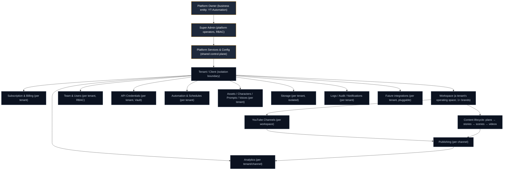
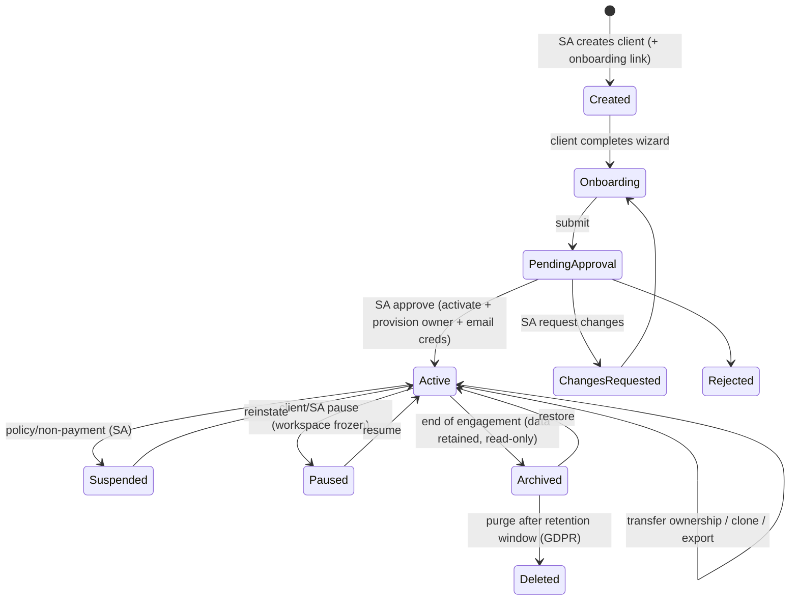

# Product Bible — PART 2: Platform Architecture & Super Admin Specification (Revision 1)

**Status: APPROVED & LOCKED.** Permanent Source of Truth (Part 2, Revision 1). Extends Part 1 (`PRODUCT-VISION.md`). **If anything here conflicts with Part 1, Part 1 wins.** Design only — no code, no schema, no migration. Prototype status marks: 🟢 exists · 🟡 partial · 🔴 not built.

**Version history:** Rev 0 (2026-07-20) — initial platform + Super Admin spec (10 deliverables). **Rev 1 (2026-07-20)** — +10 enterprise capabilities (§11), ADRs (§12), sitemap/nav/permission-matrix updated, backlog +items. **Future changes only via explicit version upgrade (Rev 2, …).**

> Perspective: the **Platform Owner** operating YT-Automation as a commercial multi-tenant SaaS. The Super Admin manages the *platform*, never a client's YouTube content.

---

## 1. Platform hierarchy (layers, ownership, relationships)



| Layer | Exists to… | Owned by | Key relationships |
|---|---|---|---|
| **Platform Owner** | Be the legal/commercial entity that sells the SaaS | Business | Employs Super Admins; owns platform config, billing revenue |
| **Super Admin** | Operate the platform (never client content) | Platform | Manages all tenants via platform tools + audited impersonation |
| **Platform Services & Config** | Shared control plane (AI gateway, billing, email, queues, secrets, flags) | Platform | Serves all tenants; never tenant-branded |
| **Tenant (Client)** | The isolation boundary — one customer business | The client | Root of all tenant-scoped data; owns everything below |
| **Subscription/Billing** | Commercial relationship + entitlements | Platform bills, tenant pays | Gates features/quotas for the tenant |
| **Workspace** | A tenant's operating space (may hold multiple brands) | Tenant | Contains channels + content |
| **Team & Users** | People operating a tenant, with roles | Tenant | RBAC within tenant; never platform access |
| **YouTube Channels** | Publishing destinations | Tenant (via own OAuth) | Belong to a workspace; per-channel publish/analytics |
| **API Credentials** | The tenant's own AI/publishing keys (Vault) | Tenant | Consumed by generation/publishing for *that* tenant |
| **Content lifecycle** | The videos being produced | Tenant | Flows plans→stories→scenes→render→publish→analytics |
| **Automation/Schedules** | Hands-free operation per tenant timezone | Tenant | Drives the lifecycle in Automatic Mode |
| **Assets/Characters/Prompts/Voices** | Reusable creative building blocks (cost saving) | Tenant | Feed generation; never shared across tenants |
| **Analytics** | Performance feedback | Tenant | Per channel; also aggregated (anonymized) at platform level |
| **Storage** | Media isolation | Tenant | Private, signed access only |
| **Logs/Audit/Notifications** | Traceability + comms | Tenant (+ platform audit) | Per tenant; platform sees platform-level events |
| **Future integrations** | Expansion (IG/TikTok/agents/plugins) | Tenant, pluggable | Provider-adapter pattern |

**Rule:** ownership never crosses the platform↔tenant line. Platform services are shared *infrastructure*; tenant data is fully isolated.

---

## 2. Platform modules (complete catalog)

Each module: Purpose · Business goal · Owner (always Platform) · Access · Dependencies · Future · DB impact · API impact · Security. (Compressed to a table; "DB/API/Security" note the *impact class*, not implementation.)

### 2.1 Core operations
| Module | Purpose / business goal | Access | Depends on | Future | DB impact | Security | Now |
|---|---|---|---|---|---|---|---|
| **Platform Dashboard** | At-a-glance platform KPIs (clients, videos, revenue, health) → operate the business | Super Admin (view) | analytics, billing, jobs | Custom widgets | reads many | RBAC read | 🟡 |
| **Client (Tenant) Management** | Full tenant lifecycle (create→delete, impersonate) → serve customers | SA (manage) | onboarding, billing, audit | Bulk ops, agencies | tenants, memberships, audit | RBAC + audit | 🟡 |
| **Onboarding & Approvals** | Review/approve client onboarding → controlled activation | SA (approve) | onboarding, email, vault | Templates, SLA timers | onboarding, profiles | audit, least-priv | 🟢 |
| **Subscriptions & Plans** | Define plans, entitlements, limits → monetization | SA (manage) | billing, entitlements | Usage-based, custom | plans, subscriptions | RBAC | 🟡 |
| **Payments & Invoicing** | Charge, invoice, dunning, tax → revenue | SA (manage) | Stripe, subscriptions | Multi-currency, resellers | invoices, ledger | PCI via Stripe | 🔴 |
| **Entitlements & Quotas** | Enforce plan limits (videos, credits, seats, storage) → protect margins | SA (config) | subscriptions, usage | Soft/hard limits | usage_counters, plans | server-enforced | 🔴 |

### 2.2 Platform configuration
| Module | Purpose | Now |
|---|---|---|
| **Platform Settings (General)** | Platform name, region, defaults, legal URLs | 🟡 |
| **Branding & Theme Engine** | Platform identity (logo/favicon/colors/fonts) — platform only | 🟢 |
| **Global AI Settings / Model Routing** | Default AI providers + routing tiers (config, not code) | 🟢 |
| **AI Providers Registry** | Register/enable providers (OpenAI/Gemini/ElevenLabs/fal/…); keys in secrets | 🔴 |
| **Publishing Providers Registry** | YouTube today; IG/TikTok/etc. via adapters (future) | 🔴 |
| **Feature Flags** | Global + per-tenant capability gating; % rollout | 🟡 |
| **Global Prompt Library / Templates** | Platform-curated prompts & automation templates tenants can inherit | 🔴 |
| **Automation Templates** | Reusable workflow presets (cadence, approval rules) | 🔴 |
| **Email/Notification Templates** | Platform-branded transactional templates | 🟡 |
| **System Defaults & Localization** | Countries, languages, timezones, currencies, tax rules | 🔴 |
| **Maintenance Mode** | Planned windows + banner + read-only mode | 🟡 |
| **Developer / Release Management** | Environments, versioning, changelog, feature releases | 🔴 |

### 2.3 Platform intelligence & ops
| Module | Purpose | Now |
|---|---|---|
| **Platform Analytics** | Business/revenue/AI/cost/growth/usage analytics (§8) | 🟡 |
| **Reports & Exports** | Scheduled/on-demand exports (finance, usage, compliance) | 🔴 |
| **Monitoring & Observability** | Metrics, error tracking (APM), traces | 🟡 |
| **System Health** | Service up/down, latency, queue depth | 🟡 |
| **Queue / Job Manager** | Inspect/retry/cancel background jobs, DLQ | 🔴 |
| **AI Gateway Console** | Central AI request routing, cost, rate limits, fallbacks | 🔴 |
| **Cost Optimizer** | Cross-tenant reuse/cache stats, savings vs naive | 🟡 |
| **Usage Tracker / Metering** | Per-tenant metered usage for billing | 🟡 |
| **Storage Manager** | Buckets, quotas, lifecycle, region, CDN | 🔴 |
| **API Health** | Third-party provider status + quotas | 🟡 |

### 2.4 Security & trust
| Module | Purpose | Now |
|---|---|---|
| **Security Center** | Central security posture, alerts, policies | 🔴 |
| **RBAC & Permission Matrix** | Roles/permissions management (platform + tenant) | 🟡 |
| **Secrets Management / Vault** | Encrypted platform + tenant secrets, rotation | 🟢 (tenant creds) |
| **Audit Logs** | Immutable record of all sensitive actions | 🟢 |
| **Session & Device Management** | Active sessions, revoke, device list (future) | 🟡 |
| **Rate Limiting & Abuse** | Per-tenant/action throttles, anomaly detection | 🟡 |
| **Compliance / Data Governance** | GDPR export/delete, data residency, retention, DPA | 🟡 |
| **Backup & Disaster Recovery** | PITR, storage replication, restore runbook | 🔴 |
| **Incident / Status Page** | Incident tracking + public status | 🔴 |

### 2.5 Growth & support
| Module | Purpose | Now |
|---|---|---|
| **Support Center / Ticketing** | Client support, secure impersonation entry | 🔴 |
| **Knowledge Base / Docs** | Self-serve help, guides, tutorials | 🔴 |
| **Announcements / Changelog** | In-product platform comms | 🟡 |
| **Onboarding Template Manager** | Configure the client setup wizard (steps, required APIs) | 🔴 |
| **Referral / Affiliate (future)** | Growth loops | 🔴 |
| **Marketplace (future)** | Templates/characters/voices for sale | 🔴 |
| **White-Label (future)** | Per-tenant/reseller branding + custom domains | 🔴 |
| **Plugin System (future)** | Third-party extensions via a stable API | 🔴 |
| **Reseller / Franchise (future)** | Sub-accounts, revenue share | 🔴 |
| **Public API & Webhooks** | Programmatic access + event delivery | 🔴 |

**Auto-added (missing enterprise modules not in the brief):** Entitlements/Quotas, AI Providers Registry, Publishing Providers Registry, Onboarding Template Manager, Queue/Job Manager, AI Gateway Console, Compliance/Data Governance, Backup/DR, Incident/Status Page, Reports/Exports, Public API & Webhooks, System Defaults & Localization, Reseller/Franchise. Reasoning: each is required to run, monetize, secure, or scale a commercial SaaS (see §9 Missing Feature Report).

---

## 3. Super Admin portal — page-by-page design

Every `/admin/*` page: platform-branded only, `is_super_admin`-gated + fine-grained platform permission, every mutating action audited. (🟢/🟡/🔴 = current prototype.)

| Page | Purpose | Key actions | Permission | Now |
|---|---|---|---|---|
| **Overview** | Platform command center (§4) | drill-downs | `platform.view` | 🟡 |
| **Clients** | List/search/filter tenants | create, edit, suspend, pause, archive, restore, delete, transfer, clone, export, import, impersonate | `platform.clients.*` | 🟡 |
| **Client Detail** | One tenant 360° (settings, users, plan, usage, health, channels, activity timeline) | status ops, assign plan, add credits, reset keys, view-as | `platform.clients.manage` | 🟡 |
| **Onboarding / Approvals** | Review submissions | approve/reject/request-changes, notes, resend creds | `platform.onboarding` | 🟢 |
| **Subscriptions** | Manage per-tenant subscriptions | change plan, trial, pause, cancel, refund | `platform.billing.manage` | 🔴 |
| **Plans & Pricing** | Plan catalog + entitlements | CRUD plans, limits, features, pricing, coupons | `platform.plans` | 🟡 |
| **Payments & Invoices** | Revenue ops | view invoices, dunning, refunds, tax config | `platform.billing.manage` | 🔴 |
| **Platform Settings** | General/localization/defaults | edit config | `platform.settings` | 🟡 |
| **Branding & Theme** | Platform look | edit platform_settings, logo/favicon | `platform.settings` | 🟢 |
| **AI Providers & Routing** | Providers + default routing | register provider, keys, routing tiers | `platform.ai` | 🟡 |
| **Publishing Providers** | Channels/platforms registry | enable providers, OAuth apps | `platform.publishing` | 🔴 |
| **Feature Flags** | Capability gating | toggle, target, rollout % | `platform.flags` | 🟡 |
| **Prompt & Automation Templates** | Global libraries | CRUD templates | `platform.templates` | 🔴 |
| **Email/Notification Templates** | Transactional comms | edit templates, test send | `platform.comms` | 🟡 |
| **Announcements & Changelog** | Platform comms | publish, schedule, target | `platform.comms` | 🟡 |
| **Automation / Queue Manager** | Job control | view/retry/cancel/DLQ replay | `platform.jobs` | 🔴 |
| **Monitoring / Observability** | Errors/metrics/traces | acknowledge, silence alerts | `platform.observe` | 🟡 |
| **System Health** | Service status | — | `platform.observe` | 🟡 |
| **API & Provider Health** | Third-party status/quotas | — | `platform.observe` | 🟡 |
| **Analytics & Reports** | Business/AI/cost analytics + exports | filter, export, schedule | `platform.analytics` | 🟡 |
| **Storage Manager** | Buckets/quotas/lifecycle | configure, purge | `platform.storage` | 🔴 |
| **Security Center** | Posture, alerts, policies | password policy, 2FA enforce, session revoke, lock, emergency access | `platform.security` | 🔴 |
| **Secrets / Vault** | Platform + tenant secrets | rotate, audit access | `platform.secrets` | 🟡 |
| **Audit Logs** | Immutable action history | search, export | `platform.audit` | 🟢 |
| **Compliance / Data Governance** | GDPR, residency, retention | export/delete tenant data, DPA | `platform.compliance` | 🔴 |
| **Backups & DR** | Backup status/restore | trigger backup, restore runbook | `platform.backups` | 🔴 |
| **Incidents / Status Page** | Incident mgmt | open/resolve, publish status | `platform.incidents` | 🔴 |
| **Support Center** | Tickets + impersonation | respond, escalate, view-as | `platform.support` | 🔴 |
| **Knowledge Base** | Docs management | CRUD articles | `platform.kb` | 🔴 |
| **Maintenance** | Maintenance mode | toggle, schedule, message | `platform.maintenance` | 🟡 |
| **Developer / Releases** | Env/version/flags | manage releases, changelog | `platform.releases` | 🔴 |
| **Public API & Webhooks** | Platform API keys, webhook config | issue keys, configure endpoints | `platform.api` | 🔴 |

---

## 4. Super Admin Dashboard — widgets (each justified)

Groups: **Business**, **Operations**, **AI/Cost**, **Health/Security**. Every widget answers a specific operator question.

| Widget | Answers | Source |
|---|---|---|
| Total / Active clients · Active workspaces | How big is the business? | tenants, memberships |
| Videos generated today · published today | Is the product producing value? | videos, pipeline_runs |
| AI usage today · AI cost today · monthly AI cost | Are we burning money efficiently? | api_usage, usage_counters |
| Revenue · MRR · ARR | Financial health | subscriptions, invoices |
| Pending approvals | Operator to-do (onboarding) | onboarding |
| Failed jobs · Queue status | Is the pipeline healthy? | jobs, render_jobs |
| API/provider health | Are dependencies up? | provider health |
| Storage usage | Capacity/cost risk | storage metering |
| Security alerts | Anything to act on now? | security events |
| Subscription overview (by plan) | Revenue mix | subscriptions |
| Recent activity / audit stream | What just happened? | audit_log, event_log |
| Platform health score | One-glance status | composite |
| Top clients (by usage/revenue) | Who matters most? | usage, revenue |
| Low-credit / near-limit clients | Who needs upsell/attention? | credit_ledger, quotas |
| System notifications | Platform-level alerts | notifications |
| Upcoming renewals · trials ending | Revenue risk/opportunity | subscriptions |
| Background jobs (running/scheduled) | What's in flight? | jobs |
| Growth (new clients, churn) | Trajectory | tenants over time |
| Cost savings (reuse/cache %) | Is cost-optimization working? | prompt_cache, assets |

Design: a "Today" hero row (revenue, videos, cost, approvals) → responsive KPI grid → live activity + alerts rail. Every metric is drill-through. Empty/loading states everywhere.

---

## 5. Client lifecycle (Super Admin)



Operations (each audited): **Create, Edit, Suspend, Pause workspace, Archive, Restore, Delete (soft→purge), Transfer ownership, Clone workspace, Export client, Import client, Client history, Activity timeline, Secure impersonation (time-boxed, logged), Approval workflow.** Deletion is soft + retention window + hard purge (compliance). Impersonation is the *only* way a Super Admin enters a client workspace.

---

## 6. Client onboarding from Super Admin (complete flow)

```mermaid
flowchart LR
  A[SA: Create Client] --> B[Generate secure credentials + onboarding link]
  B --> C[Send welcome email (platform-branded, Gmail/ESP)]
  C --> D[Client first login → forced password change]
  D --> E[Setup Wizard: how-it-works + business profile]
  E --> F[API configuration + live validation → Vault]
  F --> G[Subscription selection]
  G --> H[Payment (Stripe) — trial or paid]
  H --> I[Submit → Waiting for Approval (realtime)]
  I --> J[SA reviews: approve / reject / request changes]
  J -->|approve| K[Provision owner user + activate tenant + email]
  K --> L[Workspace activated → realtime unlock]
  L --> M[Automation ready (mode: manual default)]
```
**Added missing steps vs the brief:** forced first-login password change; live API validation before save; trial vs paid branch; realtime unlock; default to **Manual Mode** on activation (safety). Current prototype covers create→wizard→validate→submit→approve→unlock (🟡); payment + template-driven wizard are 🔴.

---

## 7. Subscription & billing architecture (design only)

**Plans:** Free · Starter · Professional · Business · Enterprise · Custom. Each plan is a **config object** of entitlements (never hardcoded):

| Entitlement dimension | Examples |
|---|---|
| Videos / month | 10 / 60 / 300 / 1200 / custom |
| AI credits | metered pool; overage rules |
| Storage | GB caps + lifecycle |
| Users / seats | per plan |
| Workspaces / brands | 1 / N |
| AI models allowed | tier gating (e.g., premium motion only on higher plans) |
| Rendering concurrency | queue priority |
| Support level | community / email / priority / SLA |
| Automation | manual-only vs full auto |
| Channels | 1 / multiple |
| Feature flags | advanced features per plan |

**Lifecycle:** Trials (time-boxed, no card or card-on-file) · Upgrades (immediate, proration) · Downgrades (end-of-period, enforce new limits) · Renewals (auto, invoice) · Grace periods (dunning on failed payment before suspend) · Cancellation (end-of-period; data retained per retention) · Coupons/Discounts · Taxes/VAT (region-aware) · Invoices/Receipts. **Enforcement:** entitlement checks gate generation/seats/storage server-side; usage metering feeds billing. Processor: **Stripe** (implementation later). Architecture must exist now (plans, subscriptions, credit_ledger, usage_counters, invoices).

---

## 8. Platform analytics (Super Admin only)

Business (clients, growth, churn, cohort) · Revenue (MRR/ARR, ARPU, LTV, expansion) · AI (calls, tokens, per-provider) · Cost (per tenant, per video, savings vs naive) · Growth (signups→active funnel) · Automation (auto vs manual, success rate) · Client (top/at-risk, usage distribution) · Subscription (plan mix, upgrades/downgrades) · Usage (videos, storage, seats) · Platform performance (latency, throughput) · System errors (rate, top errors) · Queue metrics (depth, wait, retry). All time-filtered, exportable, drill-through; heavy tables aggregated nightly (rollups) for speed.

---

## 9. Platform background services (control plane)

```mermaid
flowchart LR
  subgraph Gateway
    AIGW[AI Gateway (routing, cost, fallback, rate-limit)]
    PUBS[Publishing Service (per-tenant channels)]
  end
  subgraph Async
    QUEUE[Queue Service] --> SCHED[Job Scheduler (cron)]
    RETRY[Retry Engine + DLQ]
    MEDIA[Media Processing (FFmpeg render)]
  end
  subgraph Platform
    NOTIF[Notification Service]
    EMAIL[Email Service]
    WEBHK[Webhook Service]
    BILL[Billing Service]
    USAGE[Usage Tracker / Metering]
    SECR[Secrets Manager / Vault]
    STOR[Storage Service]
    MON[Monitoring / Logging / Health]
    CACHE[Prompt Cache + Asset Cache + Cost Optimizer]
  end
  SCHED-->QUEUE-->AIGW & MEDIA & PUBS
  AIGW-->CACHE & USAGE
  PUBS-->WEBHK & NOTIF
  BILL-->EMAIL & NOTIF
  MON-.->QUEUE & AIGW & PUBS
```
Each service: single responsibility, tenant-aware, horizontally scalable. Retry Engine + DLQ make the pipeline resilient; Cost Optimizer enforces reuse/cache-before-call; Usage Tracker feeds billing; Secrets Manager isolates per-tenant keys.

---

## 10. Permission separation (no overlap)

| Scope | Who | Examples | Never |
|---|---|---|---|
| **Platform permissions** | Super Admin roles | `platform.clients.*`, `platform.billing.*`, `platform.security`, `platform.flags`, `platform.compliance` | granted to any tenant user |
| **Tenant permissions** | Client owner/manager | manage members, credentials, brand, billing (own), channels | see other tenants / platform |
| **Workspace permissions** | Tenant roles | content create/edit/approve, schedule, publish | cross-tenant |
| **User permissions** | Individual | own profile, own sessions/2FA | others' data |

**Hard rule:** a Super Admin is **not** a tenant member (fixes ISS-C1). Tenant access for support is via **audited impersonation** only. Platform and tenant permission sets are disjoint.

---

## 11. Revision 1 — Enterprise capability additions

These extend §2's module catalog. Where a capability overlaps an existing module, it **improves/absorbs** it (noted "improves X") rather than duplicating. All are Super-Admin-only, platform-branded, audited, provider-agnostic, and tenant-isolation-preserving.

### 11.1 Internal AI Assistant (Platform Copilot) — `/admin/assistant` · perm `platform.assistant` · 🔴
A conversational operator copilot with **read-only, RAG-grounded** understanding of the whole platform (metrics, logs, jobs, usage, billing, health). Answers operational questions ("why did today's publishing fail?", "which client used the most AI credits?", "why is AI cost rising?", "which APIs are unhealthy?", "which automation failed?"), **suggests optimizations**, and **predicts issues**. Design: a tool-using agent over read-only platform APIs + a vector index of docs/runbooks; **never** mutates data (proposes actions the operator confirms); strictly platform scope (no tenant content beyond aggregates); every query audited. Powers/aligns with §11.10 recommendations and §5 impersonation ("open this client" as a suggested next step).

### 11.2 Global AI Cost Simulator — `/admin/ai/cost-simulator` · perm `platform.ai` · 🔴
"What-if" engine over the **AI Providers Registry** (§2.2) + historical usage + provider pricing/quality/latency profiles. Simulate: *"move all image generation from Provider A → B"* → estimated **monthly $ savings, quality delta, performance delta**, and risk notes. Supports **future providers** (adapter-driven pricing/quality metadata). Feeds Model Routing changes (apply-simulation → routing config) and the Recommendation Engine.

### 11.3 Feature Release Center — `/admin/releases` · perm `platform.releases` · 🔴 (**improves** Developer/Releases + Feature Flags)
Enterprise rollout system unifying flags + versioning: **Beta · Internal Testing · Limited Client Rollout · Percentage Rollout · Feature Flags · Version Control · one-click Rollback**. Targeting by tenant/plan/cohort/%; release notes → Changelog; kill-switch. Absorbs the raw Feature Flags page as its "flags" tab.

### 11.4 AI Observability Center — `/admin/ai/observability` · perm `platform.observe` · 🟡 (**improves** Monitoring + AI Gateway)
AI-specific monitoring across **all providers/models**: latency, success rate, failure rate, avg cost, token usage, queue time, provider health, model health, error types — per provider, per model, per tenant, time-series. Drives alerts, the Health Center score, and Recommendations. Distinct from generic APM (which stays in Monitoring).

### 11.5 Platform Health Center — `/admin/health` · perm `platform.observe` · 🟡 (**unifies** System Health + API Health)
One dashboard with a composite **Platform Health Score** + breakdown across: AI · Database · Queue · Storage · Billing · Notifications · Publishing · APIs · Security · Performance. Each domain shows status, key SLIs, and incidents; score is a weighted roll-up with drill-through. Replaces the separate System/API health pages (kept as detail views).

### 11.6 Prompt Governance — `/admin/prompts` · perm `platform.prompts` · 🔴 (**improves** Prompt/Automation Templates)
Enterprise prompt management: central **Prompt Library**, **version history**, **testing** (sandbox run + eval), **approval** workflow, **rollback**, **comparison/diff**, **audit**, **ownership**. Governs global prompts tenants inherit; changes are versioned + approved before promotion. Integrates with Cost Simulator (test cost) and AI Observability (prompt-level metrics).

### 11.7 Global Asset Library — `/admin/asset-library` · perm `platform.assets` · 🔴 (**extends** Global Templates)
Platform-curated reusable assets: **characters, voices, music, templates, intro, outro, visual styles, prompt templates, branding templates**. **Reuse across clients while preserving tenant isolation** via **copy-on-use** (a tenant "adopts" a library item → an isolated copy in the tenant's own library; the platform master is read-only reference). Licensing/attribution metadata; future Marketplace source.

### 11.8 Experiment Center (A/B) — `/admin/experiments` · perm `platform.experiments` · 🔴
Structured experimentation: **thumbnail, prompt, AI model, voice, publishing-time** tests. Define variants + audience + metric → collect analytics → **auto-recommend winners** (with significance) → optionally promote winner to routing/templates/schedule. Platform-level experiments; per-tenant experiments (future) inherit the framework.

### 11.9 Capacity Forecasting — `/admin/forecasting` · perm `platform.analytics` · 🔴 (**extends** Analytics)
Predictive forecasts (trend + seasonality models over historical metrics): **AI credits, storage, rendering load, queue load, API usage, revenue, active clients**. Surfaces capacity risks and prep actions (scale, provider pre-buy, quota adjustments). Feeds Recommendations and provider pre-provisioning.

### 11.10 AI Recommendation Engine — `/admin/recommendations` + dashboard cards · perm `platform.recommendations` · 🔴
Turns analytics into **actions**: switch provider to cut cost, move workloads to faster providers, detect inefficient/duplicated prompts, surface **cache opportunities**, recommend automation improvements. Continuous self-optimization loop reading Observability + Cost Simulator + Forecasting; each recommendation has rationale, projected impact, and a one-click apply (confirmed). The platform **continuously optimizes itself** (Vision §14–15).

**New nav group introduced: "Intelligence"** — Assistant · AI Observability · Cost Simulator · Recommendations · Forecasting · Experiments. Prompt Governance + Global Asset Library join **Configuration/Libraries**; Feature Release Center joins **Developer**; Platform Health Center stays in **Operations**.

## 12. Architecture Decision Records (ADR) — index
Authoritative decisions (full log in `docs/product-bible/ADR.md`):
| ADR | Decision | Status |
|---|---|---|
| ADR-001 | Two separated shells: platform console vs tenant workspace (no shared shell) | Accepted |
| ADR-002 | Super Admin is a platform role only; workspace entry via **audited impersonation** | Accepted |
| ADR-003 | Provider-adapter pattern for AI, publishing, storage (swap by config) | Accepted |
| ADR-004 | Entitlement-driven feature/quota gating from plans (server-enforced) | Accepted |
| ADR-005 | Central **AI Gateway** for all model calls (routing, cost, fallback, rate-limit) | Accepted |
| ADR-006 | Global libraries reuse via **copy-on-use** to preserve tenant isolation | Accepted |
| ADR-007 | Event bus + webhooks; nightly analytics rollups; partitioning for high-volume tables | Accepted |
| ADR-008 | Read-only, RAG-grounded AI Assistant; proposes actions, never auto-mutates | Accepted |
| ADR-009 | Feature Release Center subsumes raw flags (beta→%→rollback) | Accepted |
| ADR-010 | Platform secrets in Vault/secret store (never `.env`); impersonation time-boxed + audited | Accepted |

## Architecture validation (this document)
- **Missing modules identified & added:** entitlements/quotas, AI/publishing provider registries, onboarding-template manager, queue/job manager, AI gateway, compliance/DR, incidents/status, reports/exports, public API/webhooks, localization/tax. (§2 "Auto-added".)
- **Duplicate responsibilities:** current prototype splits usage across `/admin/usage` and `/usage`; routing across global + tenant — keep both but define global-as-default/tenant-override clearly. `announcements` vs `changelog` should be one comms module with types.
- **Scalability risks:** high-volume tables (api_usage, events, audit, pipeline_stages) need partitioning + retention; queue must be a real broker; storage→CDN/R2; analytics via rollups not live scans.
- **Security risks:** platform secrets must leave `.env` → Vault/secret store; impersonation must be time-boxed + fully audited; rate-limits need a durable store (Redis) at scale.
- **UX risks:** platform vs tenant must be visually unmistakable (different shell/brand) so operators never confuse contexts.
- **Improvements auto-applied:** provider-adapter pattern (AI + publishing + storage), entitlement-driven feature gating, event bus + webhooks for extensibility, nightly analytics rollups, DLQ/replay everywhere.

---

# REQUIRED DELIVERABLES

### D1 — Complete Platform Sitemap
```
YT-Automation
├── Public (marketing/site) [future]
├── Auth (login, reset, change-password, 2FA)
├── Platform Console (/admin) — Super Admin only
└── Tenant Workspaces (/app or (dashboard)) — per tenant
    └── (specified in Part 3)
```

### D2 — Complete Super Admin Sitemap (target)
```
/admin
├── Overview
├── Clients ├─ [id] (Detail: Users · Plan · Usage · Health · Channels · Timeline · Impersonate)
├── Onboarding & Approvals
├── Billing ├─ Subscriptions ├─ Plans & Pricing ├─ Payments & Invoices ├─ Coupons ├─ Tax
├── Configuration ├─ Settings(General/Localization) ├─ Branding & Theme ├─ AI Providers & Routing
│   ├─ Publishing Providers ├─ Feature Flags ├─ Prompt Governance ├─ Global Asset Library
│   ├─ Email/Notif Templates ├─ Onboarding Template ├─ System Defaults ├─ Maintenance
├── Operations ├─ Queue/Jobs ├─ AI Gateway ├─ Platform Health Center ├─ Storage ├─ Cost Optimizer
├── Intelligence ├─ AI Assistant ├─ AI Observability ├─ Cost Simulator ├─ Recommendations ├─ Forecasting ├─ Experiments
├── Analytics ├─ Business ├─ Revenue ├─ AI/Cost ├─ Growth ├─ Usage ├─ Reports/Exports
├── Developer ├─ Feature Release Center ├─ Environments/Versions ├─ Public API & Webhooks
├── Security ├─ Security Center ├─ RBAC/Permissions ├─ Secrets/Vault ├─ Audit Logs ├─ Sessions/Devices
│   ├─ Rate Limiting ├─ Compliance/Data Governance ├─ Backups/DR ├─ Incidents/Status
├── Growth ├─ Announcements/Changelog ├─ Support Center ├─ Knowledge Base ├─ Referral[future] ├─ Marketplace[future]
└── Platform API & Webhooks
```

### D3 — Platform Module Hierarchy
Core Ops → Configuration → Intelligence/Ops → Security/Trust → Growth/Support (as grouped in §2), all sitting in the Platform layer above the Tenant boundary (§1).

### D4 — Platform Navigation Structure
Super Admin left-nav groups: **Overview · Clients · Billing · Configuration · Operations · Intelligence · Analytics · Security · Growth · Developer**. ("Intelligence" added in Rev 1: Assistant, AI Observability, Cost Simulator, Recommendations, Forecasting, Experiments.) Global top bar: platform brand ("YT-Automation Admin"), env badge, global search (⌘K over tenants/clients/logs), **AI Assistant launcher**, platform notifications, operator menu. **Never** shows a client brand.

### D5 — Client Lifecycle Diagram — see §5.
### D6 — Platform Service Diagram — see §9.

### D7 — Super Admin Permission Matrix (illustrative)
| Permission | Super Admin (Owner) | Platform Support | Platform Billing | Read-only Auditor |
|---|---|---|---|---|
| clients.view | ✅ | ✅ | ✅ | ✅ |
| clients.manage (create/suspend/delete) | ✅ | ⛔ | ⛔ | ⛔ |
| impersonate (audited) | ✅ | ✅ (time-boxed) | ⛔ | ⛔ |
| billing.manage | ✅ | ⛔ | ✅ | ⛔ |
| plans.manage | ✅ | ⛔ | ✅ | ⛔ |
| security.manage | ✅ | ⛔ | ⛔ | ⛔ |
| flags/templates/routing | ✅ | ⛔ | ⛔ | ⛔ |
| assistant.use (AI Assistant) | ✅ | ✅ | ⛔ | ✅ (read) |
| ai.observe / ai.simulate | ✅ | ✅ (view) | ⛔ | ✅ (view) |
| recommendations.apply | ✅ | ⛔ | ⛔ | ⛔ |
| prompts.govern (Prompt Governance) | ✅ | ⛔ | ⛔ | ⛔ |
| assets.manage (Global Asset Library) | ✅ | ⛔ | ⛔ | ⛔ |
| experiments.manage | ✅ | ⛔ | ⛔ | ⛔ |
| releases.manage (Release Center) | ✅ | ⛔ | ⛔ | ⛔ |
| forecasting.view | ✅ | ✅ | ✅ | ✅ |
| audit.view | ✅ | ✅ | ✅ | ✅ |
| settings.platform | ✅ | ⛔ | ⛔ | ⛔ |
(Internal-admin sub-roles are configurable; owner = all. Rev 1 added assistant/ai/recommendations/prompts/assets/experiments/releases/forecasting permissions.)

### D8 — Missing Feature Report (priority)
- **Critical:** platform/tenant separation + impersonation console; entitlements/quota enforcement; per-tenant provider registry + Vault wiring; Payments/Stripe; Queue/Job manager.
- **High:** AI Gateway; Compliance/Data-Governance; Backups/DR; Security Center; Reports/Exports; Onboarding-Template manager; Public API/Webhooks.
- **Medium:** Support Center + KB; Incidents/Status page; Storage manager; Release management; unified comms (announcements+changelog).
- **Low/Future:** Marketplace; White-label; Plugins; Reseller/Franchise; Referral.

### D9 — Architecture Improvement Suggestions
Provider-adapter pattern (AI/publishing/storage) · entitlement-driven gating · event bus + webhooks · nightly analytics rollups + partitioning · durable queue + DLQ/replay · secrets fully in Vault · impersonation as the sole workspace-entry for operators · separate platform vs tenant shells.

### D10 — Migration Backlog updates
New items appended to `MIGRATION-BACKLOG.md` under a **Part-2 (P2-*)** batch (impersonation console, provider registries, entitlements engine, payments, queue manager, AI gateway, compliance, backups/DR, security center, support/KB, reports, public API/webhooks, onboarding-template manager, platform/tenant shell split). Existing M1–M7 mapping preserved; new epics **M8 (Platform Console completeness)** and **M9 (Commercial/Billing)** introduced. See backlog change log 2026-07-20 (Part 2).

---
**End of Part 2 — Revision 1 · Status: APPROVED & LOCKED.** Future changes only via explicit version upgrade (Rev 2+). Awaiting Part 3 (Complete Client Workspace). Permanent Source of Truth; conflicts resolve to Part 1.
