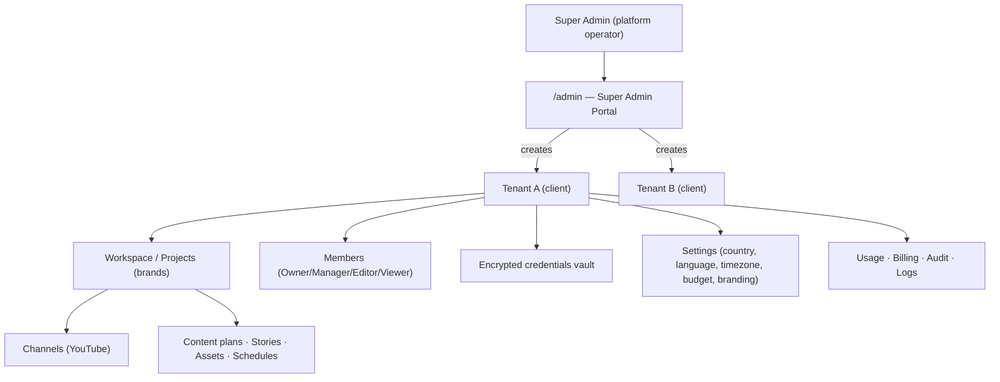
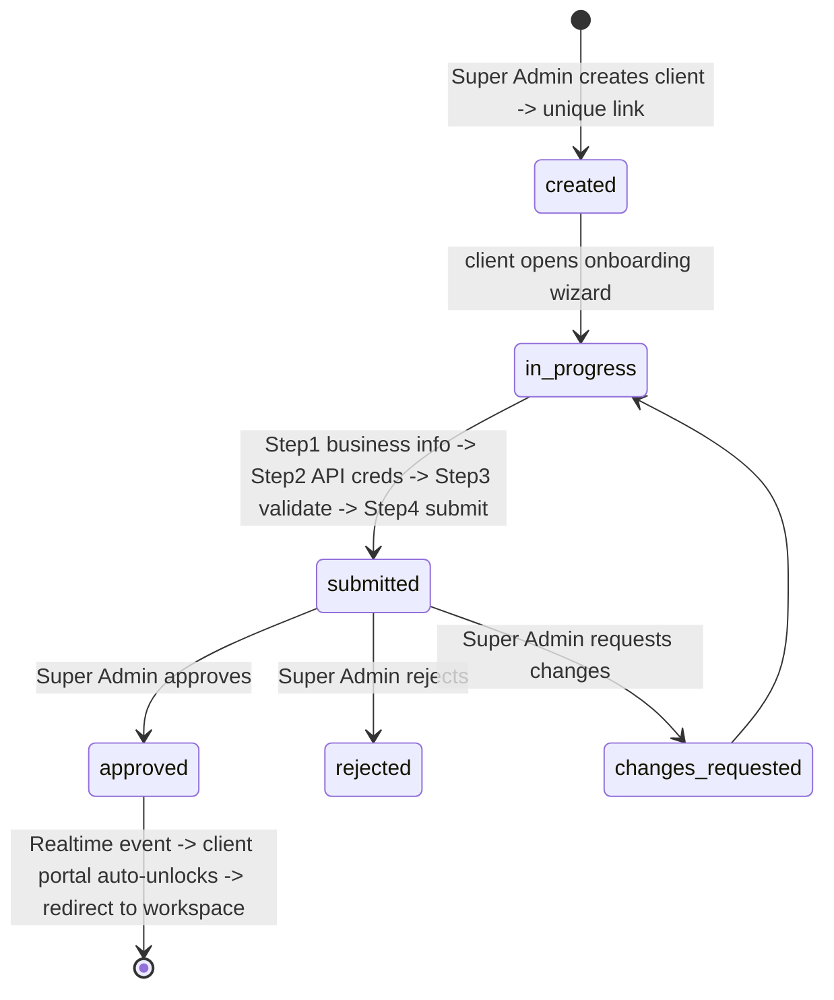

# Multi-Tenant SaaS Architecture — Transformation Blueprint

**Date:** 2026-07-18
**Status:** Proposed — **approval required before any implementation**
**Goal:** Convert the current single-owner build into a **production-grade, sellable, multi-tenant SaaS** that onboards unlimited clients with **zero code changes per client**. Everything configuration-driven, tenant-isolated, RBAC-governed, billing-ready.

---

## PART A — Architecture Review: where it's project-specific today

| # | Current (single-owner) | Problem for SaaS | Fix |
|---|---|---|---|
| 1 | One hardcoded `projects` row (`c6aff9d8…`), one owner | No tenant boundary | Introduce **`tenants`** as the isolation root; every row carries `tenant_id` |
| 2 | Dashboard reads via **service-role admin client** (bypasses RLS) | Any user sees all data — no isolation | Replace with **authenticated** Supabase client + **RLS** on every table |
| 3 | No auth at all | Can't have users/roles/clients | **Supabase Auth** + memberships + RBAC |
| 4 | API keys in one `.env` / global | Can't be per-client, not per-tenant encrypted | **Per-tenant encrypted credential vault** (pgsodium/Vault) |
| 5 | One YouTube channel (one refresh token) | Each client needs their own | **`channels`** per tenant, encrypted OAuth tokens |
| 6 | `language='en'`, niche, budget on the single project | Fine as *config*, but scoped to one tenant | Move to **`tenant_settings`**, fully configurable per tenant |
| 7 | Pipeline/stories/scenes/assets not tenant-scoped | Cross-tenant leakage | Add `tenant_id` + RLS to all |
| 8 | No super-admin, onboarding, billing, feature flags | Not operable as a product | Build **Super-Admin portal**, **onboarding**, **plans/billing schema**, **feature flags** |
| 9 | Minimal audit (`audit_log` exists, unused) | No compliance/traceability | Wire **audit logging** on every sensitive action |
| 10 | Scheduling assumes fixed 09:00 ET | Must be per-tenant timezone | **Per-tenant scheduler** (timezone, days, frequency, pause) |

**Verdict:** the *pipeline + cost engine + dashboard shell* are reusable as-is (they're already config-driven). The gap is the **tenancy, identity, isolation, onboarding, and operations** layers. That's what this blueprint adds.

---

## PART B — Tenancy model



- **Tenant** = the isolation boundary (one client/organization). Everything hangs off `tenant_id`.
- A tenant may have **multiple projects/brands**, each with **multiple channels**. (The existing `projects` table becomes tenant-scoped — a project = a brand/channel-group within a tenant.)
- **Super Admin** is a platform-level role (not a tenant member) operating the whole platform.

---

## PART C — Identity, RBAC, isolation

### Roles (configurable, not hardcoded)
`super_admin`, `internal_admin` (future), `client_owner`, `client_manager`, `client_editor`, `client_viewer`.

### Permission model — data-driven
- `permissions` table: fine-grained keys (`workspace.view`, `content.view/create/edit/approve/delete`, `schedule.manage`, `credentials.manage`, `channels.manage`, `members.manage`, `billing.view/manage`, `settings.manage`, `usage.view`, `admin.*`).
- `role_permissions` mapping — **editable by Super Admin**, so permissions change via config, never code.
- Enforcement: (1) **Postgres RLS** for data isolation; (2) **app-layer permission checks** (server actions/route handlers verify the caller's role has the permission) for actions.

### Tenant isolation (RLS on EVERY table)
- Auth JWT carries `sub` (user id). A `memberships(user_id, tenant_id, role)` table maps users → tenants.
- RLS policy pattern per tenant-scoped table:
  ```sql
  create policy tenant_isolation on <table> using (
    tenant_id in (select tenant_id from memberships where user_id = auth.uid())
  );
  ```
- Super-admin bypass: a `is_super_admin(auth.uid())` SECURITY DEFINER function OR a custom JWT claim `role=super_admin` → policies allow when true.
- Writes additionally gated by permission checks in server actions.
- **No more service-role reads from the dashboard** — the browser uses the authed anon client; RLS does the isolation. Service role is used ONLY by trusted backend workers (Modal), never in response to a browser request.

---

## PART D — Database schema (new + changed)

**New core tables** (all with `created_at`, soft-delete `deleted_at` where relevant):

```sql
tenants(id, name, slug unique, status[pending|active|suspended|locked|deleted],
        plan_id, onboarding_id, created_by, created_at)
tenant_settings(tenant_id, country, timezone, language, secondary_language,
        currency, date_format, industry, audience jsonb, brand jsonb,
        content_style, tone, upload_frequency, target_platform,
        keywords text[], negative_keywords text[], competitors text[],
        festival_calendar jsonb, seo_style, per_video_budget_usd, config jsonb)

profiles(user_id pk = auth.users.id, full_name, avatar, is_super_admin bool default false)
memberships(id, tenant_id, user_id, role, status, invited_by, created_at,
            unique(tenant_id, user_id))
roles(key pk, label, level int)            -- seedable, editable
permissions(key pk, label, category)
role_permissions(role_key, permission_key, unique(role_key,permission_key))
invitations(id, tenant_id, email, role, token unique, status, expires_at)

-- Credentials (encrypted at rest via pgsodium/Vault; values never returned to client)
tenant_credentials(id, tenant_id, provider[openai|gemini|elevenlabs|youtube|gmail|fal],
        secret_ref, meta jsonb, status[connected|invalid|expired|missing_permission|quota_exceeded],
        last_checked_at, unique(tenant_id, provider))
channels(id, tenant_id, provider default 'youtube', external_channel_id,
         title, oauth_ref, status, created_at)

-- Onboarding
onboarding(id, tenant_id, status[created|in_progress|submitted|approved|rejected|changes_requested],
        business_info jsonb, api_status jsonb, submitted_at, reviewed_by, reviewed_at,
        notes text, link_token unique)

-- Content planning + scheduling
content_plans(id, tenant_id, month, strategy jsonb, status, created_at)
plan_items(id, plan_id, tenant_id, scheduled_date, topic, angle, pillar,
        status[planned|approved|disabled|locked|generating|scheduled|published|failed],
        story_id, position int)
schedules(id, tenant_id, timezone, days int[], publish_times text[], frequency,
        pause_dates date[], holiday_mode bool, emergency_stop bool,
        retry_rules jsonb, upload_limit_per_day int)

-- Billing-ready (schema only; no processor yet)
plans(id, name, price_month numeric, limits jsonb, features jsonb)
subscriptions(id, tenant_id, plan_id, status, current_period_end, created_at)
credit_ledger(id, tenant_id, delta numeric, reason, ref, created_at)  -- AI credits
usage_counters(id, tenant_id, period, videos int, ai_calls int, storage_bytes bigint,
        cost_usd numeric)

-- Platform ops
feature_flags(id, tenant_id nullable, key, enabled bool, config jsonb)  -- null tenant = global
announcements(id, audience, title, body, active, created_at)
maintenance(id, enabled bool, message, updated_at)
audit_log(id, tenant_id, actor_user_id, action, target_type, target_id, meta jsonb, ip, created_at)
notifications(id, tenant_id, user_id, kind, title, body, read, created_at)  -- (exists; add tenant_id)
```

**Changed (add `tenant_id` + RLS):** `projects, stories, scenes, series, pipeline_runs, pipeline_stages, stage_versions, characters, character_versions, assets, prompts, voices, style_profiles, render_jobs, api_usage, videos, prompt_cache, settings, analytics`.

**Migration is additive + backfilled:** create a **"Default Tenant"**, backfill `tenant_id` on all existing rows to it, add the current owner as its `client_owner`, then enable RLS table-by-table behind a `saas_v1` feature flag so nothing breaks mid-migration.

---

## PART E — Super Admin Portal (`/admin`, super_admin only)

Sections: **Clients** (create/suspend/activate/lock/unlock/delete, reset keys, force-refresh workspace), **Onboarding queue** (approve/reject/request-changes + notes), **Client health** (API/YouTube/automation/storage/render-queue/failed-jobs per tenant), **Usage & cost** (AI/API/storage across all tenants), **Billing readiness**, **Feature flags**, **AI providers & model routing (global defaults)**, **Global prompts & system templates**, **Announcements**, **Maintenance mode**. All gated by `admin.*` permissions + super-admin RLS bypass. **Impersonation** ("view as client", fully audited) for support.

---

## PART F — Client onboarding flow (with realtime unlock)



- **Wizard step 1** — business info (all fields you listed: brand, website, country, timezone, audience, industry, language + secondary, goals, content style, platform, frequency, brand colors, logo, voice, target country/city, tone, competitors, keywords, negative keywords, CTA style, objective).
- **Wizard step 2** — API credentials (only those required): OpenAI, Gemini, ElevenLabs, YouTube (OAuth), Gmail, fal, future. **Encrypted on save.**
- **Wizard step 3** — **validate each** with a live health check → status (connected / invalid / expired / missing permission / quota exceeded). **Invalid creds cannot be saved.**
- **Wizard step 4** — submit → workspace **LOCKED**, client sees "Waiting for Super Admin Approval."
- **Approval → realtime unlock:** Super Admin clicks Approve → Supabase Realtime `postgres_changes` on `onboarding.status` pushes to the client's open page → auto-redirect into workspace, **no manual re-login**.

---

## PART G — Client workspace, content planner, scheduler, visibility

- **Workspace dashboard** (per tenant): today's schedule, current rendering, uploads (today/upcoming/completed/failed), AI credits, API status, YouTube status, storage, pending approvals, notifications, performance, recent videos, content calendar.
- **30-day Content Planner** (auto after onboarding): research-based strategy from industry + country + audience + language + goals + competitors + seasonality + trending + evergreen + objectives; balanced pillars, no repetition. **Editable calendar**: approve/reject/edit/regenerate/reorder/disable/duplicate/move-dates/lock/add-custom/import/export.
- **Automation scheduler**: per-tenant timezone (**never UTC-assumed**), days, publish times, frequency, pause dates, holiday mode, emergency stop, retry rules, failure actions, upload limits.
- **Pipeline visibility** (extend `pipeline_stages`): per-stage start times, progress %, ETA, queue position, retry count, job logs — nothing is a black box.

---

## PART H — Multi-country / multi-language / cost / security / scale

- **Multi-country:** all per `tenant_settings` (language, timezone, culture, audience, market, festival calendar, regional trends, SEO style, date format, currency). **Nothing hardcoded to US or India.**
- **Multi-language:** pipeline reads `tenant_settings.language`/`secondary_language`; story/voice/subtitles adapt automatically.
- **AI cost optimization:** the existing decision-engine + prompt-cache + asset-reuse + local-FFmpeg architecture is **tenant-scoped** (each tenant's asset library + prompt cache), same 50–70% savings, per-tenant budget cap.
- **Security:** pgsodium/Vault credential encryption; RLS isolation; app-layer permission checks; protected routes (middleware); **rate limiting** on critical endpoints (per-tenant); secrets in Vault/Modal Secrets; production auth (Supabase Auth + optional SSO later).
- **Scalability:** config-driven, zero client-specific branches; Modal serverless workers scale to 1000+ tenants / 100k+ videos; Supabase Postgres + partitioning on high-volume tables (`api_usage`, `pipeline_stages`) later; storage in Supabase→R2 past 100GB.

---

## PART I — Features you didn't list that a production SaaS needs (I'm adding these)

1. **Team collaboration** — invitations, member management, comments/mentions on content, assignment.
2. **Notification system** — in-app + email (Gmail/Resend) + webhooks; per-event preferences.
3. **Observability** — error tracking (Sentry), structured logs, metrics, health/status page.
4. **Backup & DR** — Supabase PITR, storage redundancy, documented restore runbook.
5. **Data portability / GDPR** — per-tenant export + hard-delete ("right to be forgotten").
6. **White-label branding** — per-tenant logo/colors/subdomain (future custom domains).
7. **Idempotency + retry + DLQ** — every job idempotent (partially done); dead-letter queue + replay.
8. **Soft-delete + recovery** — `deleted_at` + restore window before purge.
9. **Impersonation (audited)** — super-admin "view as client" for support.
10. **API management** — per-tenant API keys + webhooks so clients can integrate.
11. **Brand-safety / moderation** — content checks before publish (policy compliance).
12. **Rate limits & quotas** — per-plan AI/video/storage caps enforced pre-generation.
13. **Analytics rollups** — nightly aggregation per tenant for fast dashboards.
14. **Audit everything** — login, cred change, publish, approvals, automation on/off, settings.
15. **SLA/status + maintenance mode** — global + per-tenant messaging.

---

## PART J — Transformation roadmap (phased, no big-bang, no downtime)

| Phase | Deliverable | Notes |
|---|---|---|
| **S0 Foundations** | `tenants`, `profiles`, `memberships`, `roles`, `permissions`, `role_permissions`; Supabase Auth on; **Default Tenant** backfill; `saas_v1` flag | Additive; current app keeps working |
| **S1 Isolation** | Add `tenant_id` + **RLS** to all tables; swap dashboard to authed client; middleware route-protection; tenant switcher | The security core |
| **S2 Super-Admin Portal** | `/admin`: clients CRUD, health, usage, feature flags, model routing, announcements, maintenance | Platform operations |
| **S3 Onboarding** | Create-client → link → wizard (business/APIs/validate/submit) → approval → **realtime unlock** | Encrypted credential vault + health checks |
| **S4 Client workspace + Planner** | Per-tenant workspace dashboard, 30-day content planner (editable), scheduler (tenant TZ), pipeline visibility | The client product |
| **S5 Ops & billing-ready** | Audit logging everywhere, notifications, usage counters, plans/subscriptions/credits schema, rate limits, observability | Commercial readiness |
| **S6 Cloud + Phase 5** | Modal serverless pipeline (tenant-scoped) + the **paid end-to-end test** (with permission) | Only after SaaS core |

Each phase ships working software, is independently reviewable, and gates behind `saas_v1` until cutover.

---

## Decisions to confirm before S0

1. **Tenancy depth:** Tenant → Projects(brands) → Channels (recommended, supports agencies with multiple brands). Or flat Tenant=one brand. *Recommend the nested model — costs nothing now, avoids a later migration.*
2. **Credential encryption:** Supabase **Vault/pgsodium** (in-DB, simplest) vs app-layer AES+KMS. *Recommend pgsodium/Vault.*
3. **Auth:** Supabase Auth email/password + Google OAuth (super-admin = you). *Recommend yes.*
4. **You are the sole Super Admin** initially. *Confirm.*
5. **Billing:** schema now, Stripe integration deferred. *Confirm deferral.*
