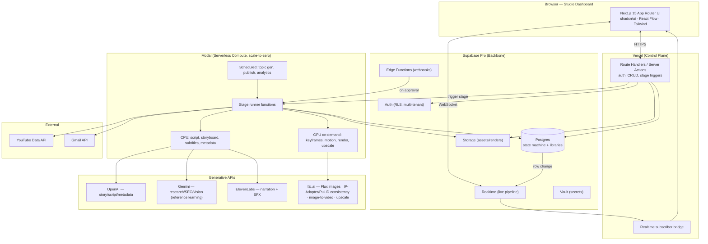
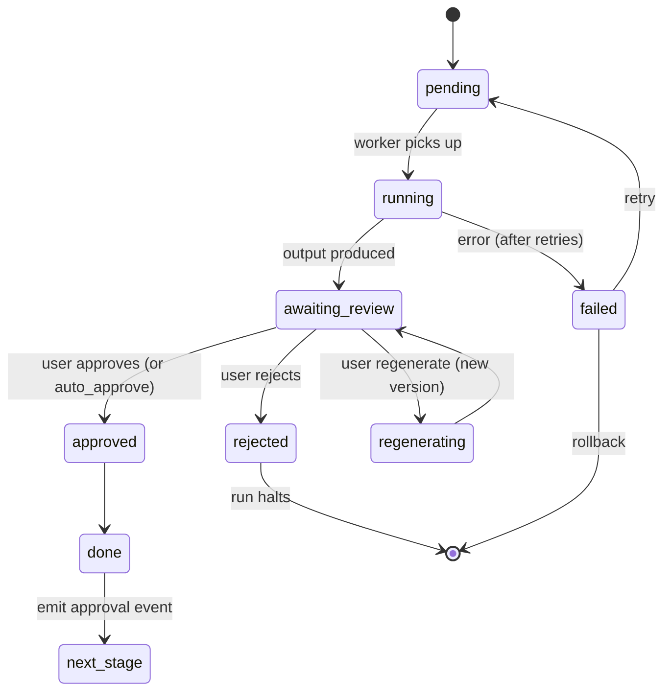
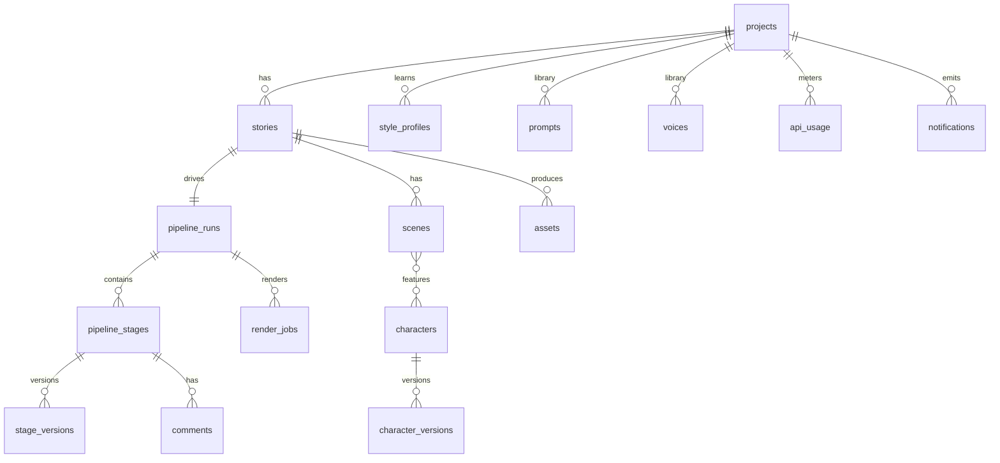
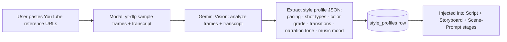
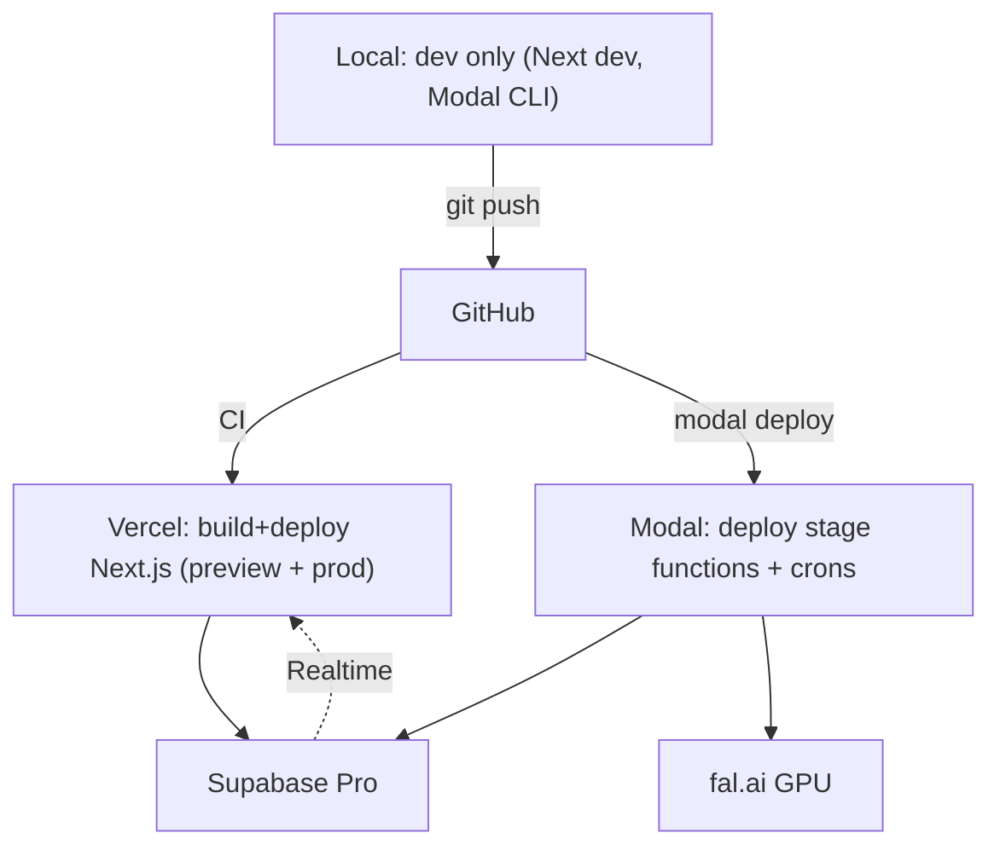

# Amber Light Stories — v3: Cinematic Short-Form AI Studio Platform

**Date:** 2026-07-18
**Status:** Proposed (implementation-ready design)
**Supersedes pipeline of:** v2 cost-optimized long-form automation. **Reuses:** Supabase schema (extended), prompt logic, adapter patterns, QA-gate concept.

**Locked decisions (this revision):**
| Decision | Choice |
|---|---|
| Visual engine | **Keyframe images → image-to-video motion clips** (hybrid, selective motion) |
| Target cost/video | **$0.50–2.00** per finished 30–60s video |
| Format | **Vertical 9:16** (YouTube Shorts / Reels / TikTok) |
| Platform + cloud | **Next.js on Vercel + Supabase + Modal (serverless Python/GPU) + fal.ai** |
| Publishing model | **Human review at every stage** — nothing auto-publishes |

---

## 0. Guiding principles

1. **Reuse, don't restart.** Supabase project, schema, prompt templates, adapter design, YouTube/Gmail OAuth, and the QA concept survive. We extend them.
2. **Cloud-first, scale-to-zero.** No always-on VM. Idle cost ≈ Supabase Pro + Vercel Hobby/Pro + Modal/fal pay-per-use. Local machine = development only.
3. **Every stage is a durable, reviewable node.** The pipeline becomes an explicit state machine in Postgres, not a fire-and-forget Celery chain.
4. **Cost governor everywhere.** Each run carries a budget; the pipeline degrades gracefully (motion clip → Ken-Burns still) to stay under the per-video cap.
5. **Short-form cinematic.** 30–60s, 9:16, 5–8 scenes, beginning→hook→conflict→resolution→ending, consistent characters.

---

## 1. Updated architecture



**Layer responsibilities**

| Layer | Tech | Role | Replaces (v2) |
|---|---|---|---|
| UI / control plane | Next.js 15 (App Router) on Vercel | Dashboard, auth, CRUD, stage triggers, realtime | FastAPI + (no UI) |
| Data / auth / realtime / storage | Supabase Pro | Source of truth, state machine, multi-tenant RLS, live updates, media | Supabase (same, extended) |
| Compute / pipeline | **Modal** serverless Python + on-demand GPU | Runs every stage; scales to zero | Docker + Celery + Redis + local FFmpeg |
| Generative | OpenAI, Gemini, ElevenLabs, **fal.ai** | Story, voice, images, motion, render helpers | OpenAI/Gemini/ElevenLabs + local Pillow/FFmpeg |
| Distribution | YouTube Data API, Gmail API | Upload, schedule, notify | same |

**Why Modal over keeping Celery/Redis:** Modal gives serverless Python (the existing task code ports almost 1:1), scale-to-zero (no idle VM/RAM — solves the "consuming too much RAM/disk" complaint), on-demand GPU per job, built-in cron + queues (replaces Beat + Redis), and per-function retries/observability. fal.ai handles all model GPU (Flux, image-to-video, upscalers) as pay-per-second so we never manage GPUs.

---

## 2. Updated video-generation pipeline (short-form cinematic)


**Stage-by-stage (the engineering contract for each):**

1. **Topic** — Gemini/OpenAI proposes short-form hooks from the project's niche + `style_profiles` (reference-learned). Output: candidate topics with a hook score. *Model:* Gemini Flash. *Cost:* ~$0.001.
2. **Research** — Gemini gathers factual/atmospheric grounding + trend signals (cached, ToS-safe). Output: research brief JSON. *Cost:* ~$0.002.
3. **Script** — OpenAI writes a **beat sheet for 30–60s**: hook (0–3s), setup, turn, climax, resolution. Hard constraint: narration word count ≈ **75–150 words** (≈ 2.3 words/sec × 45s). Output: `script.body` = ordered beats with target seconds. *Model:* `gpt-5.4`. *Cost:* ~$0.01.
4. **Storyboard** — OpenAI converts beats → shot list: per scene = purpose, framing, camera move, mood. Output: `storyboard` JSON. *Cost:* ~$0.01.
5. **Scene Breakdown** — normalize into **5–8 scene rows** with exact start/end seconds summing to total duration. Output: `scenes[]`.
6. **Character Assignment** — detect recurring characters; bind each scene to `character_id`(s) from the **Character Library**; create a character if new (canonical reference sheet). Ensures consistency inputs exist before image gen.
7. **Scene Prompt Generation** — OpenAI/Gemini writes, per scene, a structured image+motion prompt: {subject, character_ref, environment, camera angle, lens, lighting, color grade, expression, emotion, animation style, motion direction, sfx cue, music cue, narration line, subtitle text, seconds}. Output: `scene.prompt` JSON. This is the cinematic-direction core.
8. **Keyframe Images** — fal.ai **Flux** generates one keyframe per scene at 9:16 (e.g. 768×1344), conditioned on the character reference via **IP-Adapter / PuLID / InstantID** for face+identity consistency and a fixed seed per character. Optional per-character LoRA for recurring cast. *Cost:* ~$0.02–0.04 × scenes.
9. **Motion Clips (selective)** — **cost governor decides**: animate hook + climax + up to N key scenes via fal.ai image-to-video (e.g. Kling / LTX-Video / Wan) into 3–5s clips; remaining scenes get programmatic **Ken-Burns/parallax** motion at render time. *Cost:* ~$0.15–0.40 × animated scenes (kept to 3–5 clips to hold $0.50–2 total).
10. **Voice / Narration** — ElevenLabs synthesizes the (short) narration; already-built **chunking** unneeded at this length but retained. Word timestamps captured for subtitle sync. *Cost:* ~$0.02.
11. **Background Music** — select from a **royalty-free music library** (self-hosted in Supabase Storage; curated by mood) matched to `music cue`; optional generative music later. *Cost:* $0.
12. **Sound Effects** — map `sfx cue` → SFX library assets (whoosh/ambience) layered per scene. *Cost:* $0.
13. **Subtitles** — word-timed captions (from ElevenLabs timestamps or Whisper on Modal) styled for Shorts (large, safe-area, animated pop). Output: `.ass`/burned-in.
14. **Transitions** — scene-to-scene transitions (cut, dip, whip-pan) per style profile, applied at render.
15. **Render (9:16)** — Modal (FFmpeg, CPU or light GPU) composites clips/stills + motion + music + SFX + subtitles + transitions → `final.mp4` (1080×1920, H.264, faststart). *Cost:* Modal seconds (~$0.01–0.05).
16. **Thumbnail** — Flux or a title-card composite (character hero frame + bold text). *Cost:* ~$0.02.
17. **Metadata** — Gemini writes Shorts-optimized title/description/tags/hashtags. *Cost:* ~$0.002.
18. **Human Review** — final approval gate (see §7 — but every prior stage also pauses if its auto-approval is off).
19. **Schedule** — set `publishAt`; write to queue.
20. **Publish** — YouTube upload (private + `publishAt`, `#Shorts`), then Gmail confirmation. Idempotent (existing `yt_video_id` guard).

**Per-video cost model (balanced target):** script/meta ~$0.03 + 6 keyframes ~$0.18 + 4 motion clips ~$0.80 + voice ~$0.02 + render ~$0.04 + thumbnail ~$0.02 ≈ **$1.09**. Cost governor tunes motion-clip count to stay in $0.50–2.

---

## 3. Approval workflow — per-node state machine (MOST IMPORTANT)

Every pipeline node is a **`pipeline_stages`** row advancing through a strict state machine. No stage proceeds until approved (unless that stage's `auto_approve` flag is on for the project).



**Every node exposes these operations** (API + UI): `pause`, `resume`, `approve`, `reject`, `regenerate`, `edit`, `rollback`, `retry`, plus read-only: `version_history`, `logs`, `comments`, `time_taken`, `api_cost`, `model_used`, `token_usage`.

**Mechanics (durable, no long-running server):**
- A stage finishes → Modal writes output + sets `status='awaiting_review'` and stops. Nothing runs.
- Dashboard shows it (Supabase Realtime). User clicks **Approve** → Next.js Route Handler updates the stage row → Supabase **Edge Function** (DB webhook) invokes the **next** Modal stage function with the run context.
- **Regenerate** creates a new `stage_versions` row (immutable history) and re-runs only that stage. **Rollback** repoints the run to an earlier stage version and invalidates downstream outputs.
- **Auto-approval:** per project + per stage-type flag; when on, the stage transitions `awaiting_review → approved` immediately and emits the event — same code path, no branching.

This gives the exact requested graph (Topic → PAUSE → Review → Approve → Continue → Script → PAUSE → … → Publish) with pause/resume/approve/reject/regenerate/edit/version-history/logs/comments/cost/model/tokens/retry/rollback on **every** node.

---

## 4. Updated database design

**Strategy: additive, non-breaking.** Keep every existing table (`channels, videos, scripts, metadata, jobs, api_usage, analytics`). Add new tables and columns; expose a compatibility view so the legacy path keeps working during migration.



**New tables (key columns):**

```sql
-- Tenant / brand (multi-channel SaaS)
create table projects (
  id uuid primary key default gen_random_uuid(),
  owner uuid references auth.users, name text, niche text,
  aspect_ratio text default '9:16', target_seconds int default 45,
  per_video_budget_usd numeric default 2.0,
  auto_approve jsonb default '{}',        -- {"script": false, "voice": true, ...}
  config jsonb default '{}', created_at timestamptz default now()
);

-- One story = one short video project
create table stories (
  id uuid primary key default gen_random_uuid(),
  project_id uuid references projects(id),
  video_id uuid references videos(id),    -- link to legacy videos row (compat)
  topic text, logline text, beat_sheet jsonb,
  status text default 'draft', style_profile_id uuid,
  duration_seconds numeric, created_at timestamptz default now()
);

-- The state machine
create table pipeline_runs (
  id uuid primary key default gen_random_uuid(),
  story_id uuid references stories(id),
  status text default 'running',          -- running|paused|done|failed|cancelled
  current_stage text, total_cost_usd numeric default 0,
  started_at timestamptz default now(), finished_at timestamptz
);
create table pipeline_stages (
  id uuid primary key default gen_random_uuid(),
  run_id uuid references pipeline_runs(id),
  stage text not null,                    -- topic|research|script|storyboard|...|publish
  seq int not null,
  status text default 'pending',          -- pending|running|awaiting_review|approved|rejected|regenerating|failed|done|skipped
  auto_approve boolean default false,
  output jsonb, model text, tokens_used int, cost_usd numeric,
  duration_ms int, attempts int default 0, last_error text,
  approved_by uuid, approved_at timestamptz,
  created_at timestamptz default now(), updated_at timestamptz default now()
);
create index on pipeline_stages (run_id, seq);
create index on pipeline_stages (status);

create table stage_versions (           -- immutable history for regenerate/rollback
  id uuid primary key default gen_random_uuid(),
  stage_id uuid references pipeline_stages(id),
  version int, output jsonb, cost_usd numeric, model text,
  created_at timestamptz default now()
);

-- Cinematic scene graph
create table scenes (
  id uuid primary key default gen_random_uuid(),
  story_id uuid references stories(id), seq int,
  start_sec numeric, end_sec numeric,
  prompt jsonb,                           -- {subject,camera,lighting,color,emotion,motion,...}
  keyframe_asset_id uuid, motion_asset_id uuid,
  narration text, subtitle text, music_cue text, sfx_cue text,
  animate boolean default false           -- cost governor sets true for key scenes
);

-- Character consistency
create table characters (
  id uuid primary key default gen_random_uuid(),
  project_id uuid references projects(id), name text,
  descriptor jsonb,                       -- face,hair,clothes,style,identity
  reference_asset_id uuid, seed bigint, lora_url text,
  created_at timestamptz default now()
);
create table character_versions (
  id uuid primary key default gen_random_uuid(),
  character_id uuid references characters(id), version int,
  descriptor jsonb, reference_asset_id uuid, created_at timestamptz default now()
);

-- Media (versioned)
create table assets (
  id uuid primary key default gen_random_uuid(),
  project_id uuid, story_id uuid, scene_id uuid,
  kind text,                              -- keyframe|motion|audio|music|sfx|render|thumbnail
  storage_path text, meta jsonb, cost_usd numeric,
  version int default 1, created_at timestamptz default now()
);

-- Reference-learning
create table style_profiles (
  id uuid primary key default gen_random_uuid(),
  project_id uuid references projects(id), name text,
  source_urls jsonb,                      -- YouTube reference links
  profile jsonb,                          -- {pacing,shots,color,transitions,narration,music}
  created_at timestamptz default now()
);

-- Libraries
create table prompts (
  id uuid primary key default gen_random_uuid(),
  project_id uuid, name text, kind text, template text,
  version int default 1, created_at timestamptz default now()
);
create table voices (
  id uuid primary key default gen_random_uuid(),
  project_id uuid, name text, provider text default 'elevenlabs',
  voice_id text, settings jsonb, created_at timestamptz default now()
);

-- Ops
create table render_jobs (
  id uuid primary key default gen_random_uuid(),
  run_id uuid, status text default 'queued', progress numeric default 0,
  modal_call_id text, started_at timestamptz, finished_at timestamptz, cost_usd numeric
);
create table notifications (
  id uuid primary key default gen_random_uuid(),
  project_id uuid, user_id uuid, kind text, title text, body text,
  read boolean default false, created_at timestamptz default now()
);
create table audit_log (
  id uuid primary key default gen_random_uuid(),
  project_id uuid, user_id uuid, action text, target text, meta jsonb,
  created_at timestamptz default now()
);
```

**Extend existing tables (additive):** `api_usage` += `project_id, story_id, stage`; `videos` += `story_id, project_id, aspect_ratio` (keeps legacy publish path working). **RLS** on every new table keyed by `project_id`/`owner` for multi-tenant SaaS.

---

## 5. Reference-learning workflow (YouTube style analysis)



- **Legal/ToS:** we analyze publicly available frames/transcripts to derive **stylistic parameters only** (numbers and adjectives), never store or redistribute source footage, never reproduce copyrighted characters or exact shots. Generation is style-inspired, not derivative. Document this in Settings with a consent checkbox.
- The `profile` JSON becomes a first-class input to prompt generation, so "make it feel like these references" is deterministic and tunable per project.

---

## 6. Web platform — UI/UX

**Stack:** Next.js 15 (App Router, RSC + Server Actions), TypeScript, Tailwind, **shadcn/ui**, **React Flow** (pipeline graph), **Recharts** (analytics/cost), **TanStack Query** + Supabase Realtime, **next-themes** (dark/light). Auth via Supabase Auth. Deploy on Vercel.

**Route / section map (the ~18 sections):**
```
/dashboard                     Overview: KPIs, recent jobs, activity feed, system health
/projects                      Project (channel/brand) switcher + settings
/queue/videos                  Video Queue (all runs, filters, bulk ops)
/queue/stories                 Story Queue (pre-production)
/queue/rendering               Rendering Queue (render_jobs, live progress)
/pipeline/[runId]              LIVE pipeline visualization (React Flow, per-node review)
/scenes/[storyId]              Scene Viewer (storyboard, keyframes, motion, timing)
/library/characters            Character Library (consistency assets, versions)
/library/prompts               Prompt Library (versioned templates)
/library/voices                Voice Library (ElevenLabs voices, previews)
/library/media                 Asset Management (images/clips/audio, preview)
/settings/models               AI Model Settings (per-stage model + params)
/settings/style                Reference-learning / style profiles
/uploads                       Upload History (YouTube)
/analytics                     YouTube Analytics (views, CTR, retention)
/usage                         API Usage + Cost Monitoring (per stage/model/project)
/system/workers                Workers (Modal functions, concurrency, health)
/system/health                 System Health (queues, storage, error rates)
/logs                          Logs (searchable, per run/stage)
/notifications                 Notifications / Activity Feed
/settings                      Settings (project, auto-approval matrix, integrations)
```

**Live pipeline page (`/pipeline/[runId]`)** — the centerpiece:
- **React Flow** node graph of all stages; node color = state (pending/running/awaiting_review/approved/failed). Running node pulses; ETA + progress bar on render node.
- Right **review drawer** on node click: output preview (story text / storyboard / image / video / voice player / subtitle overlay), plus buttons Approve · Reject · Regenerate · Edit · Rollback · Retry, and tabs Version History · Logs · Comments · Cost/Model/Tokens/Time.
- Header rail: worker status, queue depth, CPU/RAM/storage (Modal + Supabase metrics), API $ so far, live logs ticker.
- **Realtime:** Supabase `postgres_changes` on `pipeline_stages`/`render_jobs` → instant UI updates, no polling.

**Global UX:** dark/light, responsive, command palette (⌘K) + keyboard shortcuts (a=approve, r=regenerate, j/k=nav nodes), global search, saved filters, bulk operations, media/story/voice/prompt preview modals, activity feed, performance charts, approval workflow surfaced everywhere. Design language: premium "AI production studio" — deep neutrals, one accent (amber), generous spacing, motion on state changes.

---

## 7. Cloud infrastructure & deployment



- **Vercel:** frontend + control-plane APIs. Preview deploy per PR, prod on main. Env from Vercel project settings.
- **Modal:** `modal deploy` ships stage-runner functions + scheduled functions (topic gen, publish, analytics). Scale-to-zero; GPU attached only to image/motion/render functions. Secrets via Modal Secrets (mirror of `.env`).
- **Supabase:** managed; migrations via `supabase db push` (SQL in `db/migrations/`). Storage buckets: `keyframes`, `motion`, `audio`, `renders`, `thumbnails`, `music`, `sfx` (+ CDN). Move to Cloudflare R2 only past 100GB.
- **No-downtime migration:** additive schema + feature flag `pipeline_v3` per project. Legacy Python/Docker path keeps running for existing flows until a project is flipped to v3. Decommission Docker/Celery/Redis once all projects migrated.
- **Secrets:** single source in Supabase Vault / Vercel / Modal Secrets — never in code. (Reminder: rotate the currently-exposed keys before production.)

---

## 8. API integrations & cost strategy

| API | Purpose | Est. cost | Why needed | Free/OSS alternative |
|---|---|---|---|---|
| **OpenAI** (owned) | Story, script, storyboard, scene prompts, metadata | ~$0.03/video | Best narrative structure | Gemini (already secondary) |
| **Gemini Pro** (owned) | Research, SEO, subtitle timing, **vision for reference learning** | ~$0.005/video | Cheap high-volume + multimodal | — |
| **ElevenLabs Pro** (owned) | Narration + optional SFX | ~$0.02/video | Best voice; you own Pro | Kokoro/Piper self-host on Modal (overflow) |
| **fal.ai** (NEW) | Flux keyframes, IP-Adapter/PuLID consistency, image-to-video, upscale | ~$1.0/video | Serverless GPU for images+motion, pay-per-sec, no GPU ops | Replicate (similar), or self-host ComfyUI on Modal GPU (cheaper at scale, more ops) |
| **Modal** (NEW) | Serverless compute/orchestration/render/cron | ~$0.05/video + free tier | Scale-to-zero Python + GPU + cron; replaces Docker/Celery/Redis | RunPod serverless / Trigger.dev self-host |
| **Vercel** (NEW) | Frontend + API hosting | $0–20/mo | Best Next.js DX, preview deploys | Self-host Next on Hetzner (more ops) |
| YouTube Data / Gmail (owned) | Publish + notify | $0 (quota) | Distribution | — |

**Additional paid services recommended:** only **fal.ai + Modal + Vercel**. Everything else reuses your subscriptions. **Music/SFX:** curated royalty-free library in Supabase Storage ($0). **Cost optimization levers:** (1) per-video budget governor tuning motion-clip count; (2) cache research/style/topic; (3) Flux-schnell for drafts, Flux-dev for finals; (4) batch keyframes; (5) Modal scale-to-zero kills idle cost; (6) Kokoro self-host for TTS overflow; (7) generate thumbnail from an existing keyframe, not a fresh gen.

**Projected monthly (30 videos/mo, balanced):** ~30 × $1.1 = **$33 generation** + Supabase Pro (owned) + Vercel (~$0–20) + Modal (~$5–15 incl. free tier) ≈ **$40–70/mo new spend** — within a lean SaaS budget, scaling linearly per video.

---

## 9. What changes in the existing repo (file-level)

| Existing (v2) | Action | v3 target |
|---|---|---|
| `docker-compose.yml`, `Dockerfile` | Retire after migration | Modal app (`modal_app.py`) |
| `worker/celery_app.py`, `beat.py`, `tasks/base.py` | Replace orchestration | Modal functions + Supabase state machine |
| `worker/tasks/*.py` | **Port logic** to Modal stage functions (prompts/adapters reused) | `modal/stages/*.py` |
| `ai/llm/*`, `ai/tts/*`, `ai/prompts/*` | **Reuse** (rewrite prompts for 9:16 short-form + scene JSON) | same, extended |
| `apis/youtube.py`, `gmail.py`, `analytics.py`, `google_auth.py` | **Reuse** as-is (idempotent upload kept; add `#Shorts`) | same |
| `media/render.py` | Rework for 9:16, motion-clip compositing, subtitles, transitions | `modal/render.py` |
| `app/` (FastAPI) | Replace with Next.js control plane | `web/` (Next.js) |
| `db/schema.sql` | Extend additively | `db/migrations/00x_v3.sql` |
| Supabase project | **Reuse** (same data, new tables) | same |

**Backward compatibility:** legacy `videos/scripts/metadata` remain written (via a compat shim) so the existing YouTube publish + analytics keep functioning during transition; `stories.video_id` links new→old.

---

## 10. Implementation roadmap (phased, no big-bang)

**Phase 0 — Foundations (1–2 wks).** Supabase migration (§4 tables, RLS). Scaffold Next.js on Vercel + Supabase Auth. Set up Modal app + fal.ai account + secrets. Feature flag `pipeline_v3`.

**Phase 1 — Short-form pipeline (2–3 wks).** Port stages to Modal; rewrite prompts for 30–60s 9:16; keyframes (Flux) + character consistency v1; selective image-to-video; 9:16 render with subtitles/music/transitions; cost governor. **Goal: one 45s cinematic Short end-to-end, auto (no review yet).**

**Phase 2 — Review state machine + core dashboard (2–3 wks).** `pipeline_stages` engine with pause/approve/reject/regenerate/rollback; Edge Function approval→next-stage; `/pipeline/[runId]` live React Flow page + review drawer + Realtime; Video/Story/Rendering queues.

**Phase 3 — Libraries + consistency + reference learning (2 wks).** Character Library + versioned consistency; Prompt/Voice/Media libraries; YouTube reference-learning workflow → style profiles injected into prompts.

**Phase 4 — Full studio + SaaS (2–3 wks).** Remaining sections (analytics, usage/cost monitoring, workers, system health, logs, notifications, settings/auto-approval matrix); multi-project RLS; billing hooks; polish (⌘K, shortcuts, bulk ops, themes).

**Phase 5 — Cloud cutover + scale (1 wk).** Flip all projects to v3; decommission Docker/Celery/Redis; load/perf test; observability + alerts.

Each phase ships working software and is independently reviewable; each gets its own spec→plan→implementation cycle using the existing subagent-driven workflow.

---

## 11. Open decisions to confirm before Phase 1 build

1. **image-to-video model** on fal.ai (Kling v2 vs LTX-Video vs Wan) — pick by cost/quality test on 3 sample scenes.
2. **Character consistency method** — IP-Adapter/PuLID (zero-train, cheaper) vs per-character LoRA (higher fidelity, small train cost). Recommend PuLID first, LoRA for hero characters.
3. **Music source** — start with curated royalty-free library; add generative music later only if needed.
4. **Auth/tenancy** — single-owner now, but build RLS multi-tenant from day one (cheap insurance for SaaS).
```
