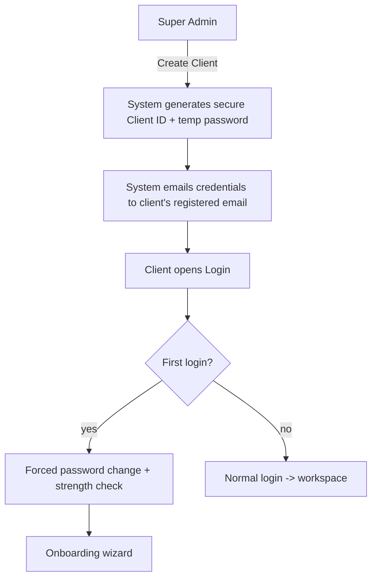

# Phase 6 — Complete Enterprise SaaS Experience (Platform + Client Portal)

**Date:** 2026-07-19
**Status:** Proposed — **approval required before implementation**. $0 (UX/auth/branding only; no paid generation).
**Builds on:** S0–S5 (tenancy, auth, RLS, super-admin, onboarding, workspace, billing schema — all live).

**North star:** a **sellable, brandable, enterprise SaaS** where the *platform* has its own identity and each *client* runs their own branded YouTube-automation business inside it — with never a public sign-up, guided education, and a premium experience for non-technical users.

---

## PART 1 — Platform vs Client branding (the core mental model)

Two brand layers, always separate:

| Layer | Brand | Where it shows | Configured by |
|---|---|---|---|
| **Platform** | e.g. **"YT Automation"** | Login screen, Super-Admin portal, system emails, loading screen, favicon, platform chrome | **Super Admin** (Theme settings) |
| **Client (tenant)** | e.g. "Amber Light Stories", "Indian Motivation", "Kids Learning" | *Only inside that client's workspace* — their logo, colors, name | Each **Client Owner** (Brand Kit) |

- A client **never** sees platform internals or another client's brand.
- "Amber Light Stories" is demoted from *the app name* to **the Default tenant's client brand**. The platform becomes **"YT Automation"** (configurable).
- New tables: `platform_settings` (singleton: platform name, logo, favicon, theme tokens, loading screen). `tenant_settings.brand` already exists for client branding; extend with logo/favicon/theme.
- **Runtime theming:** both platform and client themes are sets of CSS variables injected at render (server reads settings → sets `:root` vars). Changing a color in settings re-themes the app with no code change.

---

## PART 2 — Authentication system (no public sign-up, ever)

**Principle:** clients cannot self-register. Only Super Admin provisions accounts.



**Features to build (all $0, Supabase Auth-based):**
- **Login** (exists) — polished, platform-branded, with error states + lockout messaging.
- **No Sign-Up route anywhere** (enforce; remove any register path).
- **Forced password change on first login** — `profiles.must_change_password` flag; middleware routes such users to `/change-password` before anything else.
- **Forgot / Reset password** — Supabase Auth reset email flow (`resetPasswordForEmail`) + `/reset-password` page.
- **Email verification** — accounts created with `email_confirm:true` by admin; verification for self-initiated email changes.
- **Session management** — Supabase SSR sessions (exists); add "active sessions" view + "sign out everywhere".
- **Logout** (exists) — everywhere in the user menu.
- **Account lock after N failed attempts** — track `failed_login_attempts` + `locked_until` on profiles (or an `auth_attempts` table); lock 15 min after 5 fails; super-admin can unlock.
- **Password strength validation** — client-side meter + server-side policy (length, classes) on set/change.
- **Password expiry (future-ready)** — `password_changed_at` + optional policy; not enforced yet.
- **Credential delivery email** — on Create Client, email the temp password via the platform's email (Gmail API already wired, or Supabase invite email). Template is platform-branded.

New: `auth_attempts` (or fields on profiles), `profiles.must_change_password`, `profiles.password_changed_at`, `profiles.locked_until`.

---

## PART 3 — Educational onboarding wizard (reduce confusion)

After first login + password change, the client enters a **guided wizard** (not the raw dashboard). It teaches as it collects.

**Wizard sections:**
1. **Welcome & how it works** — what the platform does, how AI automation generates videos (a simple visual pipeline explainer), the human-approval model.
2. **Business profile** — brand, country, timezone, audience, language, goals, competitors, keywords, tone, CTA style (S3 collects these; now with helpful copy).
3. **API setup — educational per provider.** For **each** API (OpenAI, Gemini, ElevenLabs, YouTube, Gmail, fal) show a card with:
   - **Purpose** (why we need it), **Required permissions/scopes**, **Official website link**, **Step-by-step "How to generate"** (numbered), **Documentation link**, **Test Connection button** → live **Validation status** + **Connection status** badge.
   - "Where to get it" mini-guides embedded (collapsible), plus a Help panel and a placeholder for future video tutorials.
4. **Subscription (future-ready)** — plan selection UI (Free/Starter/Growth/Scale from S5). Payment step is **stubbed** ("Billing activates soon") but the flow slot exists.
5. **Review & Submit for approval** — summary; submit → **locked / "Waiting for Super Admin Approval."**
6. **Realtime approval unlock** — Super Admin approves → client page auto-enters workspace without re-login (S3 polling exists; upgrade to Supabase Realtime).

---

## PART 4 — Payment & approval flow (future-ready)

```mermaid
flowchart LR
  C[Client created] --> L[Login] --> S[Subscription select] --> P[Payment (stub)]
  P --> O[Onboarding] --> V[API validation] --> SUB[Submit for approval]
  SUB --> W[Waiting] --> R[Super Admin review]
  R -->|Approve| U[Workspace unlocks - realtime]
  R -->|Reject / Request changes| O
```

Payment is architected but stubbed (no processor now). The `subscriptions`/`plans`/`credit_ledger` schema (S5) already supports Stripe later with no redesign.

---

## PART 5 — Client Portal Information Architecture (every page justified)

Organized into logical groups. **Each page states the problem it solves.**

### Group: Home
| Page | Why it exists / problem solved |
|---|---|
| **Dashboard** | "What's happening today?" — the daily command center (see Part 6). Solves: at-a-glance situational awareness. |
| **Workspace** | Identity of the client's business (brand, plan, health, progress). Solves: "what is my account/status?" |

### Group: Content
| Page | Problem solved |
|---|---|
| **Content Strategy** | The high-level plan/pillars for the channel. Solves: direction, avoids random content. |
| **30-Day Planner** | Concrete month of topics (S4). Solves: never run out of ideas; batch planning. |
| **Content Calendar** | Time view of what publishes when. Solves: scheduling clarity. |
| **AI Content Generator** | Kick off generation for a topic. Solves: turning a plan item into a video. |
| **Manual Content** | Add a custom topic/script outside AI. Solves: creative control. |
| **Content Approval** | Review queue for generated content before publish. Solves: quality gate. |

### Group: Production
| Page | Problem solved |
|---|---|
| **Video Pipeline** | Live per-stage progress + review (Phase 2). Solves: "where is my video?" no black box. |
| **Rendering Queue** | What's rendering + ETA. Solves: capacity/throughput visibility. |
| **Publishing** | Upload status + schedule to YouTube. Solves: distribution control. |

### Group: Assets & Brand
| Page | Problem solved |
|---|---|
| **Assets Library** | All media (images/clips/audio/renders). Solves: reuse, cost savings. |
| **Characters Library** | Consistent characters incl. uploaded faces. Solves: identity consistency. |
| **Brand Kit** | Logo, colors, fonts, voice, tone for the client. Solves: on-brand output + client branding. |
| **Prompt Library** | Reusable prompt templates. Solves: consistency + control of AI. |

### Group: Automation
| Page | Problem solved |
|---|---|
| **Automation** | On/off + rules for hands-free operation. Solves: scale without manual work. |
| **Schedules** | When/how often to publish, per timezone (S4). Solves: cadence. |
| **YouTube** | Channel connection + status. Solves: destination management (multi-channel future). |

### Group: Insights
| Page | Problem solved |
|---|---|
| **Analytics** | Views/CTR/retention/subs. Solves: what's working. |
| **Activity Logs** | Audit/activity feed (S5). Solves: traceability, trust. |
| **Notifications** | Events needing attention (S5). Solves: nothing missed. |

### Group: Account
| Page | Problem solved |
|---|---|
| **API Management** | View/rotate/test the client's API keys (Vault, S3). Solves: connectivity control + security. |
| **Billing** | Plan, credits, usage, invoices (S5, stub). Solves: commercial self-service. |
| **Team Members** | Invite teammates. Solves: collaboration. |
| **Roles & Permissions** | Who can do what (RBAC, S0). Solves: least-privilege governance. |
| **Settings** | All configuration (Part 7). Solves: control. |
| **Security** | Sessions, password, lock status, 2FA (future). Solves: account safety. |
| **Profile** | Personal info. Solves: identity. |
| **Support / Help Center** | Docs, guides, contact. Solves: self-serve help, reduces churn. |

Nothing exists without a job. Pages already built (Phase 1–S5) are marked reused; the rest are new in Phase 6.

---

## PART 6 — Dashboard (the daily command center)

Answers "what is happening today?" in one screen: upcoming videos, videos generating, rendering status, publishing status, today's uploads, tomorrow's uploads, errors, pending approvals, content ready, storage usage, AI usage, API health, latest analytics, recent activity, upcoming scheduled jobs. Layout: a "Today" hero strip + a responsive grid of purpose-built cards + a live activity rail. Quick actions (Generate video, Approve queue, View calendar). Empty states guide new clients ("Generate your 30-day plan").

---

## PART 7 — Settings module (everything configurable)

Grouped settings: **Workspace, Business, Brand, Language, Timezone, Country, Default Voice, Default AI Models, Upload, Automation, Notifications, Email, Security, API, Team, Content, Publishing.** Each is a section with clear controls, sensible defaults from onboarding, and per-tenant persistence (`tenant_settings` + related). Save via server actions with audit logging.

---

## PART 8 — Theme customization (Super-Admin, platform-wide)

Super-Admin → Theme settings controls the **platform** look: Primary/Secondary/Accent color, Sidebar color, Background, Button style, Border radius, Font, Dark/Light defaults, Brand logo, Favicon, Loading screen, **Platform name**. Stored in `platform_settings`; applied as CSS variables at runtime across the whole SaaS (no redeploy). Architecture also allows **tenant-specific themes** later (client Brand Kit overrides within their workspace).

---

## PART 9 — UX principles

Simple, minimal, professional, modern, fast, responsive, beautiful, and **easy for non-technical users**. Every onboarding step reduces confusion (plain language, "why", "where to get it", test buttons). Consistent OLED-dark + configurable accent, Inter, 8pt spacing, accessible contrast, keyboard-friendly, skeletons over spinners.

---

## PART 10 — Future readiness (modular by design)

Architecture leaves clean seams for: multiple YouTube channels, other platforms (Instagram/Facebook/LinkedIn/TikTok/X/Pinterest), AI agents, WhatsApp/mobile notifications, billing (Stripe), marketplace, plugins, white-label, resellers. Achieved via: provider-abstracted channels table, per-tenant feature flags, config-driven modules, and the platform/tenant branding split (white-label ready).

---

## PART 11 — Proactively added (I'm the founding team)

Not in your list, but a sellable SaaS needs these — I'm including them:
1. **2FA / TOTP** (future-ready toggle in Security).
2. **Impersonation ("view as client")** for super-admin support — audited (S2 has the hook).
3. **Global search (⌘K)** across content/pages.
4. **In-product changelog / announcements** surfaced to clients (S5 announcements).
5. **Email templates system** (platform-branded) for credentials, approvals, alerts.
6. **Data export / GDPR delete** per tenant.
7. **Status/health page** + maintenance banner (S2 maintenance).
8. **Onboarding progress persistence** (resume where you left off).
9. **Accessibility pass** (WCAG AA, focus, reduced-motion).
10. **Empty-state coaching** everywhere for non-technical users.

---

## PART 12 — Phased implementation (each phase: build → test → deploy → next)

| Phase | What | Why | $ |
|---|---|---|---|
| **P6.1 Platform branding + theme engine** | `platform_settings` + CSS-var theme runtime + rename app to "YT Automation" (config), super-admin Theme settings, favicon/logo/loading | Separate platform vs client identity; white-label foundation | $0 |
| **P6.2 Auth hardening** | Forced password change, forgot/reset, account lock, strength meter, credential email, remove any sign-up | Enterprise-grade secure access; no public registration | $0 |
| **P6.3 Educational onboarding** | Wizard rewrite: how-it-works + per-API guides (purpose/scopes/where-to-get/steps/test) + subscription step + realtime unlock | Non-technical clients succeed without help | $0 |
| **P6.4 Client portal IA** | Fill in missing modules (Content Strategy, Calendar, AI Generator, Manual Content, Brand Kit, Team, Roles, Security, Profile, Support) + reorganize nav into groups | Complete, purposeful product surface | $0 |
| **P6.5 Dashboard + Settings + Workspace polish** | The daily command center, full settings module, workspace identity page | Daily value + full configurability | $0 |
| **P6.6 UX + proactive extras** | ⌘K search, 2FA scaffold, email templates, accessibility, empty-state coaching, data export | Premium, enterprise-ready feel | $0 |

Each phase is fully built, tested (`npm run build` + smoke), deployed, and reviewed before the next. No half-finished modules.

---

## Decisions to confirm before P6.1

1. **Platform name** now = **"YT Automation"** (temporary, configurable in Theme settings later). OK, or a different working name?
2. **Credential-delivery email:** send via the **Gmail API** already wired (from `amberlightstories1985@gmail.com`) vs Supabase's built-in invite email. *Recommend Gmail API for a branded template.*
3. **"Amber Light Stories"** becomes the **Default tenant's** client brand (not the platform brand). Confirm.
4. **Scope order:** proceed P6.1 → P6.6 in order (branding/theme first so everything after inherits it). Confirm.
