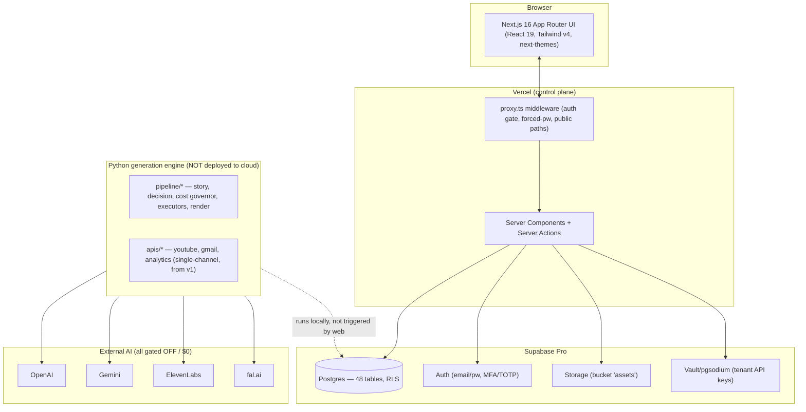

# YT Automation — Product Architecture Document (PAD)

**Date:** 2026-07-20 · **Status:** Audit / documentation (no code changes) · **Audience:** new engineers, investors, enterprise clients
**Live:** https://web-iota-jade-53.vercel.app · **Repo:** github.com/Kunalmishra77/amber-light-stories
**Scope of this document:** a complete, verified A–Z audit of the platform as it exists today, its problems, and the roadmap to production. Facts below were verified against the live database (48 tables), the route map, and `src/lib/auth.ts` — not assumed.

---

## 0. Executive summary

**What this is:** a multi-tenant SaaS ("**YT Automation**") for AI-generated short-form video. A **Super Admin** operates the platform; **clients** (tenants like "Amber Light Stories") run their own branded video-automation businesses inside it. Content is cost-optimized cinematic 9:16 shorts, generated through a human-review pipeline.

**Two halves exist and are only partially joined:**
1. **Control plane (web)** — Next.js 16 app on Vercel + Supabase (Postgres/Auth/Storage/RLS). Auth, tenancy, RBAC, super-admin portal, onboarding, client portal (~38 pages), billing schema, ops. **Live and working.**
2. **Generation engine (Python)** — `pipeline/*`: story→scene decision engine, cost governor, fal/ElevenLabs/FFmpeg executors, 9:16 render. **Built and unit-tested (91 tests), gated to $0, but NOT wired to the web app end-to-end.** It runs via local dry-run scripts, not triggered from the dashboard.

**Biggest architectural gaps (detailed in §7, §8, §12):**
- **Super-admin identity is conflated with a client-owner** → the platform operator sees a client workspace. (Confirmed root cause below.)
- **Control plane ↔ generation engine are disconnected** — the cloud bridge (Modal) was designed but never deployed; the dashboard's "generate" is currently a mock state-machine advance, not real generation.
- **No live automation runner** (scheduler is config-only), **no analytics data pipeline**, **single hardcoded YouTube channel** (not per-tenant), **billing has no processor**.

**Cost/paid status:** no paid generation has ever run. Everything is $0 by an explicit standing rule; the paid end-to-end test is frozen pending owner approval.

---

## 1. Complete project audit

### 1.1 Current architecture (as-built)

**Key truth:** the arrow from Python→Postgres is dashed because the two halves are not integrated. The web app writes/reads Supabase; the Python engine also reads/writes Supabase — but nothing in the web app *invokes* the Python engine. The intended bridge (Modal serverless) is unbuilt.

### 1.2 Folder structure
```
amber-light/
├── web/                         # Next.js 16 control plane (deployed to Vercel)
│   └── src/
│       ├── app/
│       │   ├── login, forgot-password, reset-password, change-password   # public auth
│       │   ├── onboarding/[token]/(steps, waiting)                        # public wizard
│       │   └── (dashboard)/      # authed shell: ~38 client pages + admin/*
│       ├── components/           # sidebar, topbar, command-palette, notification-bell,
│       │                         #   theme-toggle, client-time, stat-card, status-badge…
│       └── lib/                  # auth.ts, branding.ts, supabase/{server,client,admin},
│                                 #   ops/{audit,notify,events,rate-limit,usage}, email/*,
│                                 #   onboarding/*, planner/mock-plan, security/*
├── pipeline/                     # Python generation engine (16 modules, 91 tests) — NOT deployed
├── apis/                         # v1 YouTube/Gmail/Analytics adapters (single-channel)
├── ai/, media/, worker/, app/    # v1 long-form remnants (legacy; superseded by pipeline/)
├── db/migrations/                # 001–010 SQL (source of truth for schema)
├── docs/superpowers/specs/       # design docs (v3, cost-opt, multitenant, phase6, this PAD)
└── storage/                      # local render artifacts (gitignored)
```
**Legacy note:** `ai/`, `media/`, `worker/`, `app/` are v1 long-form-pipeline code, largely superseded by `pipeline/`. They should be archived/removed (see §12).

### 1.3 Database structure (48 tables — full doc in §9)
Grouped: **Tenancy/identity** (tenants, tenant_settings, profiles, memberships, roles, permissions, role_permissions, invitations) · **Platform ops** (platform_settings, feature_flags, announcements, maintenance, audit_log, event_log, rate_limits, notifications) · **Onboarding/creds** (onboarding, tenant_credentials[+Vault], channels) · **Content** (projects, series, stories, scenes, scripts, metadata, characters, character_versions, style_profiles, prompts, voices, content_plans, plan_items) · **Pipeline** (pipeline_runs, pipeline_stages, stage_versions, render_jobs, jobs, prompt_cache, assets) · **Billing/usage** (plans, subscriptions, credit_ledger, usage_counters) · **Config** (settings, schedules) · **Analytics** (analytics — empty). Every tenant-scoped table carries `tenant_id` + RLS.

### 1.4 Authentication flow (working)
Supabase Auth (email/password, MFA/TOTP available). `proxy.ts` middleware gates all non-public routes → `/login`; if `profiles.must_change_password` → forces `/change-password`. Account lockout (5 fails/15 min), forgot/reset, strength policy. **No public sign-up** — only Super Admin provisions accounts (via onboarding approval → creates auth user + emails temp credentials via Gmail API). Session = Supabase SSR cookies.

### 1.5 API flow (working, control-plane only)
The browser calls **Server Actions / Route Handlers** (never a public REST API). Reads go through the **authed Supabase client** (RLS scopes to tenant); privileged writes (create user, vault) use the **service-role admin client** (server-only, `import 'server-only'`). There is **no external/public API** for clients yet (planned, §12).

### 1.6 AI flow (built, NOT wired to web)
`pipeline/story.py` (one structured OpenAI call → story+scenes+decision metadata) → `pipeline/decision.py` (per-scene: reuse asset / prompt-cache hit / generate / local-motion) → `pipeline/executors.py` (fal image+motion, ElevenLabs voice — **all `live=False` by default, $0 mock**) → `pipeline/render.py` (FFmpeg 9:16 assembly, real). Cost governor enforces $1.55 cap. **Reality:** this runs from `pipeline/dryrun.py`/`render_dryrun.py` on a dev machine. The web app's `/generate` action performs a **mock stage advance** using pre-seeded content — it does not call this engine.

### 1.7 Automation flow (config-only — NO runner)
`schedules` table + `/schedule` UI capture per-tenant timezone/days/times/pause/holiday/emergency-stop. **There is no process that reads schedules and triggers generation/publishing.** v1 had Celery/Beat (removed). The cloud runner (Modal cron) is undeployed. So automation is presently declarative, not executed.

### 1.8 Rendering flow (built, local)
`pipeline/render.py` composes per-scene motion clips + narration + burned subtitles → 1080×1920 H.264/AAC via FFmpeg. Verified: a real placeholder MP4 renders at $0. Not triggered from web; `render_jobs` table exists but is unused by any live worker.

### 1.9 Upload/publish flow (v1 adapters, not multi-tenant)
`apis/youtube.py` (idempotent upload, private+publishAt), `apis/gmail.py` (confirmations) exist from v1 and use a **single** Google OAuth refresh token / one channel (`UC741-…`) in `.env`. **Not** wired to per-tenant `channels`/`tenant_credentials`. `/publishing` and `/youtube` client pages are status/placeholder.

### 1.10 Client management (working)
Super Admin creates a tenant + onboarding link (`/admin/clients`); client self-onboards; admin approves → owner user created + tenant activated. Status transitions (pending/active/suspended/locked/deleted) + plan assignment + credit grants + audited actions all work.

### 1.11 Permission system (working)
Roles: super_admin, internal_admin(reserved), client_owner, client_manager, client_editor, client_viewer. `role_permissions` **is seeded (68 rows)** and `requirePermission()` checks it (super-admin bypasses). `isOwnerOrManager()` gates tenant-admin actions. RLS enforces data isolation independently of app checks. *(Note: `auth.ts:141` has a stale comment claiming role_permissions is empty — it is not; §12 cleanup.)*

### 1.12 UI structure (working, one shell)
A single `(dashboard)` shell (sidebar grouped nav + topbar with ⌘K palette, notification bell, theme toggle, user menu) renders BOTH the client workspace pages and (for super-admins) an appended "Super Admin" nav group. OLED-dark + amber, Inter, runtime CSS-var theming from `platform_settings`. **This single-shell design is the source of the §7 problem.**

---

## 2. Super Admin portal — page by page

All under `/admin/*`, guarded by `admin/layout.tsx` (`is_super_admin` → else 404) + `requireSuperAdmin()` in every action. Reads use super-admin RLS bypass; privileged writes use service role. Common tables: as noted.

| Page | Purpose | Key actions | Tables | Status | Missing / improve |
|---|---|---|---|---|---|
| `/admin` Overview | Platform KPIs across all tenants | — (read) | tenants, stories, videos, pipeline_stages, maintenance | Working | Real-time tiles; trend charts |
| `/admin/clients` | List/create/manage clients | create client(+onboarding link), suspend/activate/lock/delete | tenants, tenant_settings, onboarding, audit_log | Working | Search/filter, pagination, bulk ops |
| `/admin/clients/[id]` | Client detail | status actions, assign plan, add credits, unlock user | tenants, memberships, subscriptions, credit_ledger, usage | Working | Impersonation ("view as"), full cred reset |
| `/admin/onboarding` | Review submissions | approve/reject/request-changes; approve creates owner user + emails creds | onboarding, profiles, memberships, tenants | Working | Diff view, checklist, SLA timers |
| `/admin/flags` | Feature flags (global+tenant) | toggle/add | feature_flags | Working | Flag targeting %, audit |
| `/admin/announcements` | Platform messaging | create/toggle | announcements | Working | Scheduling, audience segments |
| `/admin/maintenance` | Maintenance mode | toggle + message | maintenance | Working (banner shows) | Scheduled windows, status page |
| `/admin/routing` | Global default AI model routing | edit JSON routing | settings(tenant_id null) | Working | Per-plan routing, cost preview |
| `/admin/plans` | Billing catalog | edit plans | plans | Working (no Stripe) | Stripe products, entitlements |
| `/admin/usage` | Cross-tenant usage/cost | — | usage_counters, api_usage, stories/videos | Working | Export, per-provider breakdown |
| `/admin/health` | Cross-tenant system health | — | pipeline_runs/stages, jobs | Working | Live workers, alerting |
| `/admin/observability` | event_log + audit + stats | — | event_log, audit_log | Working | Sentry/external APM, error grouping |
| `/admin/theme` | Platform branding/theme | edit platform_settings | platform_settings | Working | Logo upload, tenant themes, live preview |

**Global super-admin gaps:** audited **impersonation** (biggest — needed instead of §7 membership hack), provider/API-key management at platform level, plan→entitlement enforcement, background-job control.

---

## 3. Client portal — page by page (tenant = Amber Light Stories today)

All under `(dashboard)`, tenant-scoped via RLS. Grouped as in the sidebar. Status legend: **Working** (real data + actions), **Partial** (UI real, logic/mock or depends on the unbuilt generation bridge), **Placeholder** (structure + empty state).

**Home** — `/` Dashboard (Working; daily command center) · `/workspace` (Working; identity/plan/health).
**Content** — `/strategy` (Placeholder) · `/planner` (Working; 30-day **mock** plan, $0) · `/calendar` (Working) · `/generate` (**Partial** — mock stage advance, not real generation) · `/manual` (Partial; adds a topic) · `/approvals` (Working; review queue) · `/style` Reference Learning (Partial; stores URLs, analysis deferred).
**Production** — `/pipeline` (Working; per-node review state machine, paid-stage gates) · `/rendering` (Placeholder) · `/publishing` (Placeholder) · `/videos` (Working list) · `/workers` (Placeholder).
**Library** — `/stories` (Working) · `/scenes` (Working) · `/assets` (Working; storage) · `/characters` (Working; upload face) · `/brand` Brand Kit (Working) · `/prompts` (Working) · `/voices` (Working) · `/uploads` (Partial).
**Automation** — `/automation` (Partial; toggle stored, no runner) · `/schedule` (Working config; no runner) · `/youtube` (Placeholder; not per-tenant).
**Insights** — `/analytics` (Placeholder; no data source) · `/usage` (Working) · `/logs` (Working; audit+event) · `/notifications` (Working) · `/health` (Working).
**Account** — `/api-management` (Working; Vault creds status/test) · `/billing` (Working UI; no Stripe) · `/team` (Working; invite/roles) · `/roles` (Working; RBAC view) · `/settings` (Working; sectioned) · `/settings/models` (Working; routing) · `/security` (Working; 2FA/TOTP, sessions, data export, deletion request) · `/profile` (Working) · `/support` (Placeholder).

*(Every page's why/who/tables/permissions is the row above; §10 gives the connection rules.)*

---

## 4. Information architecture
```
YT Automation (Platform)
├── Public
│   ├── /login  /forgot-password  /reset-password  /change-password
│   └── /onboarding/[token] → /onboarding/[token]/waiting
├── Super Admin (/admin/*, super_admin only)
│   ├── Overview · Clients (+[id]) · Onboarding · Feature Flags · Announcements
│   ├── Maintenance · Model Routing · Plans · Usage · Health · Observability · Theme
├── Client Workspace ((dashboard), tenant-scoped)
│   ├── Home: Dashboard · Workspace
│   ├── Content: Strategy · Planner · Calendar · AI Generator · Manual · Approval · Reference Learning
│   ├── Production: Pipeline · Rendering · Publishing · Video Queue · Workers
│   ├── Library: Stories · Scenes · Assets · Characters · Brand Kit · Prompts · Voices · Uploads
│   ├── Automation: Automation · Schedules · YouTube
│   ├── Insights: Analytics · Usage & Cost · Activity Logs · Notifications · System Health
│   └── Account: API Mgmt · Billing · Team · Roles · Settings · AI Models · Security · Profile · Support
```
**Problem:** "Super Admin" and "Client Workspace" currently render in the **same shell** for the admin user (see §7).

---

## 5. User journeys

**Super Admin:** login → `/admin` overview → create client (name+owner email) → copy onboarding link → (client onboards) → `/admin/onboarding` review → approve (creates user, emails creds, activates tenant) → monitor via usage/health/observability. *Today, because the admin is also a tenant member, they also land on a client dashboard — incorrect (§7).*

**Client:** receives emailed credentials → `/login` → **forced password change** → **onboarding wizard** (how-it-works → business info → API keys w/ validation+Vault → plan → submit) → **waiting for approval** → (admin approves) → **auto-unlock** into workspace → generate 30-day plan → create/approve content → (intended) automation publishes daily. *Today the generate/publish tail is mock/undeployed.*

**Video lifecycle (intended):** topic → research → script → storyboard → scenes → character assignment → scene prompts → keyframes → motion → voice → subtitles → render → thumbnail → metadata → **human review at each node** → schedule → publish → analytics. *Today: pipeline **state machine + review UI** exist; the **execution** of paid stages is gated/mock.*

---

## 6. New client onboarding (step by step, as-built)
1. **Super Admin → /admin/clients → Create Client** (business name + owner email) → inserts `tenants`(pending) + `tenant_settings` + `onboarding`(link_token). Shows the `/onboarding/{token}` link.
2. **Client opens link** (no account yet; token-gated). Wizard: **Welcome/how-it-works** → **Business info** (saved to onboarding + tenant_settings) → **API keys** (OpenAI/Gemini/ElevenLabs/fal validated live-free; stored **encrypted in Vault** via `store_credential` RPC; YouTube/Gmail optional) → **Plan select** → **Submit** (status=submitted) → **Waiting** page (polls every 3s).
3. **Super Admin → /admin/onboarding → Approve** → `onboarding=approved`, `tenants=active`, **creates the owner auth user** (service-role) with a strong temp password + `profiles.must_change_password=true` + `memberships(client_owner)`, **emails credentials** (Gmail, best-effort), shows temp password once.
4. **Client's waiting page detects approval → redirects to /login** → signs in → **forced password change** → enters workspace.
5. **Workspace opens** → generate 30-day plan (mock, $0) → review content. *(Automation "begins" only once the runner + generation bridge are built.)*

**Gaps:** credential email is best-effort (no retry/queue); approval is non-transactional (user-create + activate not atomic); realtime unlock is polling (fine) not Supabase Realtime.

---

## 7. Architecture problem: "Amber Light Stories" inside Super Admin — root cause & fix

**Observed:** logged in as the platform Super Admin, you also see the "Amber Light Stories" **client workspace**.

**Verified root cause (not a UI glitch):** the Super Admin user (`amberlightstories1985`) has a **`memberships` row as `client_owner` of the `default` (Amber Light Stories) tenant** (confirmed in the DB). `getCurrentTenantId()` (`auth.ts:81`) returns the user's **first active membership** when no tenant cookie is set → the default tenant → so the `(dashboard)` shell renders that tenant's **client workspace**, and because `is_super_admin` is true, the **admin nav is also appended**. Both surfaces render in one shell.

**Category:** primarily an **architecture issue** (single shell mixing platform + tenant surfaces) triggered by a **development shortcut** (during S0/S1 I made the admin own the default tenant so there'd be seed data to view) — with a **tenant-isolation smell** (a platform operator is a member of a client tenant).

**Correct enterprise architecture:**
1. **Super Admin is a platform role, not a tenant member.** Remove the admin's membership in client tenants. Platform operators have **no default workspace**.
2. **Separate surfaces/shells.** `/admin/*` is the platform console (its own chrome + platform brand). Client workspace (`(dashboard)`) is tenant-only. A super-admin with no membership should land on `/admin`, never a client dashboard.
3. **To view a client, use audited impersonation** ("View as tenant") — a deliberate, logged, time-boxed context switch — never standing membership.
4. **Keep a dedicated demo/sandbox tenant** (already have "Demo Client") for testing the client experience, entered via impersonation, not via the admin's own login.
5. **Routing guard:** if `is_super_admin` and not impersonating → redirect `/` → `/admin`. If a normal user has 0 memberships → a "no workspace" state, never another tenant's data.

*(This is the #1 correctness fix in the roadmap, §13 Phase 1.)*

---

## 8. Tenant isolation review

| Layer | Isolated? | Notes |
|---|---|---|
| Platform vs Tenant branding | ✅ (P6.1) | platform_settings vs tenant_settings.brand |
| Data (Postgres) | ✅ RLS on all tenant tables | `is_super_admin()` bypass + `my_tenant_ids()` membership scoping (migration 004) |
| Content/Settings/Assets/Analytics/Logs/Notifications | ✅ | all carry tenant_id + RLS |
| API credentials | ✅ | per-tenant, encrypted in Vault; secrets never leave server |
| Users/roles | ⚠️ **Mixed** | super-admin is also a tenant member (§7) — the one real isolation breach |
| Storage | ⚠️ Partial | single public `assets` bucket, path-prefixed by tenant, but bucket is public-read (any asset URL is guessable/enumerable) |
| Automation/Publishing/Channels | ❌ Not isolated | single global YouTube channel + one Google token in `.env` (v1), not per-tenant |
| Generation engine | ❌ Not tenant-aware end-to-end | Python engine reads keys from `.env`, not per-tenant Vault; not invoked per tenant |

**Fixes:** remove admin membership (§7); make Storage private + signed URLs; wire publishing/channels/generation to per-tenant `tenant_credentials`/`channels` (Vault) so each client uses *their own* keys and channel.

---

## 9. Database documentation (key tables)

| Table | Purpose | Owner/scope | Security | Notes / future |
|---|---|---|---|---|
| `tenants` | Client/organization = isolation root | platform | RLS (super-admin + members) | add `deletion_requested`, region |
| `tenant_settings` | Per-tenant config (country, tz, language, brand, budget, keywords…) | tenant | RLS | split brand→own table for versioning |
| `profiles` | 1:1 auth.users; `is_super_admin`, `must_change_password`, lockout fields | user | RLS | add 2FA-enrolled, last_login |
| `memberships` | user↔tenant↔role | tenant | RLS | **super-admin should not appear here (§7)** |
| `roles`/`permissions`/`role_permissions` | RBAC (68 perms seeded) | platform | RLS read | per-tenant custom roles later |
| `invitations` | pending team invites | tenant | RLS | expiry enforcement |
| `platform_settings` | singleton: platform name/logo/favicon/theme | platform | public-read, admin-write | logo storage |
| `feature_flags` | global+tenant flags | both | RLS | % rollout |
| `onboarding` | wizard state + business_info + api_status + link_token | tenant | RLS + token access | idempotent approve (txn) |
| `tenant_credentials` | provider→**Vault secret ref**, status | tenant | RLS (status only; secret in Vault, service-role RPC) | rotation, expiry checks |
| `channels` | YouTube (extended from v1) | tenant | RLS | **wire per-tenant OAuth (currently unused)** |
| `stories`/`scenes`/`scripts`/`metadata` | content graph | tenant | RLS | — |
| `characters`/`character_versions` | consistent characters (+uploaded face) | tenant | RLS | embedding for reuse |
| `content_plans`/`plan_items` | 30-day strategy | tenant | RLS | AI-research plan (currently mock) |
| `schedules` | per-tenant publishing cadence | tenant | RLS | **needs a runner** |
| `pipeline_runs`/`pipeline_stages`/`stage_versions` | review state machine | tenant | RLS | progress %, ETA fields |
| `assets` + `prompt_cache` | media + hash cache (cost saving) | tenant | RLS | pHash/embedding reuse |
| `render_jobs`/`jobs` | job records | tenant | RLS | **no live worker consumes these** |
| `plans`/`subscriptions`/`credit_ledger`/`usage_counters` | billing (Stripe-ready) | platform/tenant | RLS | Stripe integration |
| `api_usage` | per-call cost log | tenant | RLS | rollups/partitioning at scale |
| `audit_log`/`event_log` | audit + observability | tenant/platform | RLS | retention, export |
| `rate_limits` | per-tenant action throttling | tenant | RLS | Redis/Upstash at scale |
| `analytics` | YouTube metrics | tenant | RLS | **empty — no ingestion pipeline** |
| `settings` | model_routing (+global row) | tenant/platform | RLS | typed config |
| `projects`/`series`/`style_profiles`/`voices`/`prompts` | supporting content | tenant | RLS | — |

**Indexing/scale:** high-volume tables (`api_usage`, `pipeline_stages`, `event_log`, `audit_log`) will need time-based partitioning + retention. Storage moves to Cloudflare R2 past 100 GB.

---

## 10. Page documentation — connection rules
Every page: **access** = middleware (auth) + (`/admin/*` → super_admin) + tenant RLS; **permissions** via `requirePermission`/`isOwnerOrManager`; **data** = its tenant's rows only. Connections: Planner→Calendar→Generate→Pipeline→Approvals→Publishing (content lifecycle); Characters/Brand/Voices/Prompts feed Generate; Usage/Billing/Settings/Model-Routing govern cost; API-Mgmt/Security/Team/Profile govern the account. (Per-page purpose/tables enumerated in §2–§3.)

## 11. Settings documentation
- **Platform (/admin/theme, super-admin):** platform name, logo/favicon emoji, loading message, theme tokens (colors/radius/font/mode) → live CSS vars.
- **Model routing (/admin/routing global; /settings/models per-tenant):** image High/Med/Low, motion premium/standard/cheap, thumbnail — config, not code.
- **Workspace/Business/Region/Content (/settings):** brand, industry, audience, goals; language/secondary/timezone/country/currency/date-format; content_style/tone/keywords/negative_keywords/competitors/upload_frequency/target_platform → `tenant_settings`(+`config`).
- **Automation (/automation, /schedule):** enable toggle, timezone, days, publish times, pause dates, holiday, emergency-stop, retry, upload limit → `schedules` (**no runner yet**).
- **API (/api-management):** per-provider key status/test (Vault). **Security (/security):** password, 2FA/TOTP, sessions, data export, deletion request. **Notifications:** in-app + prefs (email prefs stored; email send best-effort). **Billing (/billing):** plan/credits/usage (no Stripe). **Publishing/YouTube:** placeholders (not per-tenant).

## 12. Missing features (prioritized)

**Critical (blocks a real product):**
- **Super-admin/tenant separation + impersonation** (§7).
- **Control-plane ↔ generation-engine integration** — a real job runner (Modal or a queue+worker) that the dashboard triggers; wire executors to **per-tenant** Vault keys. Without this, no client can actually make a video from the UI.
- **Live automation runner** (cron reading `schedules` → enqueue generation/publish).
- **Per-tenant YouTube/Gmail OAuth + channels** (replace the single `.env` token). Publishing pipeline end-to-end.
- **Private storage + signed URLs** (assets bucket is public).
- **Rotate the leaked dev credentials** before any real use.

**High:**
- **Analytics ingestion** (YouTube Analytics → `analytics` → dashboards).
- **Stripe billing** + entitlement/quota enforcement from plans.
- **Real AI content planner** (replace mock 30-day generator).
- **Transactional onboarding approval**; credential-email retry/queue.
- **Observability** (Sentry/APM), alerting, backups/PITR runbook, DLQ+replay.
- **Reference-learning execution** (Gemini vision over sampled frames).

**Medium:**
- Multi-channel/multi-platform (IG/TikTok/etc.) abstraction.
- Notifications: email/webhook delivery, digest.
- Search across content; bulk ops; pagination on large lists.
- Supabase Realtime for approval/pipeline live updates (currently polling/refresh).
- Legacy cleanup (`ai/`, `media/`, `worker/`, `app/`), fix stale `auth.ts` comment, fix `workers/page.tsx` `Date.now()` purity lint.

**Low:**
- White-label per-tenant themes; custom domains; resellers; marketplace/plugins; mobile app; i18n of the console; keyboard-shortcut expansion.

## 13. Implementation roadmap

**Phase 1 — Correctness & isolation (redesign, no new surface):** remove super-admin's tenant membership; split admin vs workspace routing (`is_super_admin`→`/admin`); build **audited impersonation**; make storage private + signed URLs; **rotate all leaked credentials**. *Depends on nothing; unblocks trust.*

**Phase 2 — Close the generation loop ($0 until final test):** stand up the **job runner** (Modal or queue+worker); wire the web `/generate` + pipeline stages to actually invoke `pipeline/*` using **per-tenant Vault keys**; connect `render_jobs`/`jobs` to a real consumer; keep paid calls gated behind explicit approval. *Depends on Phase 1 isolation for per-tenant keys.*

**Phase 3 — Automation & publishing:** cron runner over `schedules`; per-tenant YouTube/Gmail OAuth + `channels`; end-to-end publish + confirmation; emergency-stop/holiday honored. *Depends on Phase 2.*

**Phase 4 — Commercial:** Stripe billing + entitlements/quotas from `plans`; analytics ingestion + dashboards; real AI 30-day planner; notifications delivery. *Depends on Phase 2–3 for usage signals.*

**Phase 5 — Hardening & scale:** observability/APM + alerting; backups/DR; partitioning + retention on high-volume tables; DLQ/replay; accessibility + performance pass; legacy removal. *Ongoing.*

**Phase 6 — Growth/enterprise:** multi-platform, white-label/custom domains, public API + webhooks, team collaboration depth, marketplace/resellers. *After GA.*

**Keep unchanged (already sound):** the RLS tenancy model, RBAC schema, cost-optimization architecture (decision engine/prompt-cache/asset-reuse/local-FFmpeg), the review state machine, onboarding wizard, platform/tenant branding split, Phase-6 auth hardening.
